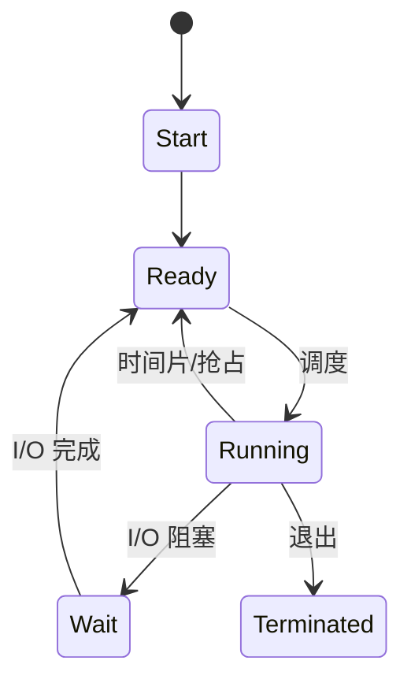

# Process and Thread Notes

## 进程

进程是程序的一次执行，是 CPU 调度与资源分配的执行单位。OS 负责创建、调度、终止。主进程创建出来的叫 **child process**。

每个进程有一块 **PCB（Process Control Block）**，用 **PID** 标识，至少包含：

1. Process State（ready / running / waiting …）
2. Process Privileges（能否碰系统资源）
3. PID
4. Pointer（指向父进程）
5. Program Counter（下一条指令）
6. CPU registers
7. CPU Scheduling Information（优先级等）
8. Accounting Information（CPU 用量、时限）
9. I/O Status Information（已分配设备）

### 五状态机

原笔记里的流程图：

任意时刻进程处于：Start、Ready、Running、Blocked/Waiting、Terminated。

### OS 的三条队列

1. **Job Queue**：系统里所有进程
2. **Ready Queue**：已在内存、等 CPU
3. **Waiting Queue**：因缺 I/O 而阻塞

一个进程可以有多条线程。

## 线程

线程是 CPU 利用的基本单位：一个 PC、一个栈、一组寄存器、一个 thread ID。也叫 lightweight process。

传统进程只有一条控制流。多线程进程里，每条线程有自己的 PC/栈/寄存器，但**共享**代码、数据、打开文件。线程必须属于某个进程，不能脱离进程存在。

## 上下文切换

保存当前进程/线程状态，之后再恢复。这样多个进程才能共享一颗 CPU。

## 进程 vs 线程

| | 进程 | 线程 |
| --- | --- | --- |
| 定义 | 正在执行的程序 | 进程里的一段执行流 |
| 终止/创建 | 更慢 | 更快 |
| 通信 | 更慢（跨地址空间） | 更快（共享内存） |
| 上下文切换 | 更重 | 更轻 |
| 资源 | 消耗更多 | 消耗更少 |
| 数据 | 默认不共享 | 彼此共享地址空间 |
