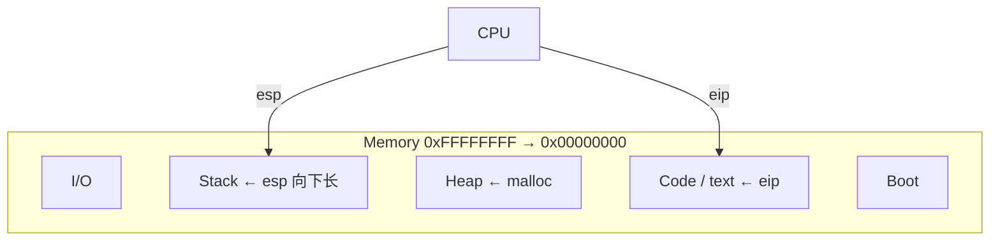
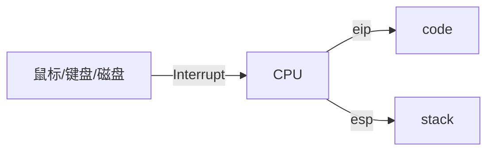
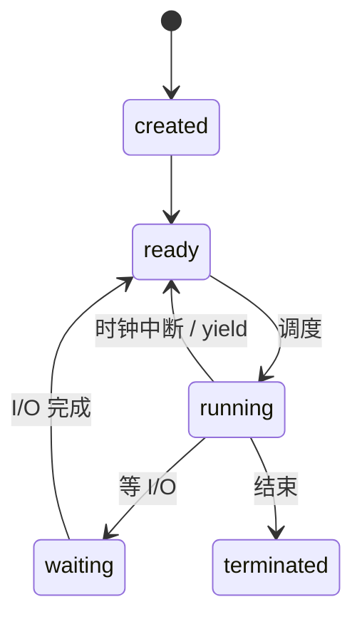

# Week 1：体系结构、启动、并发、进程抽象

来源：`CSCC69 Week 1 Notes.pdf`

## 简单计算机

一台机器 = **Memory + CPU**。CPU 按 **ISA**（指令集）执行位串：算术、读写、位运算、跳转。现代 x86-64 大约有 2000 条指令。

跑一个程序时，内存大致长这样（原笔记图）：

- **Stack**：LIFO，函数、返回地址、参数。`esp` 指向栈顶。
- **Heap**：动态分配（`malloc`/`free`），没有固定分配顺序，管理更复杂。

## Bootstrapping

启动是一条链，不需要人插手：

1. 上电，CPU 执行 **BIOS**
2. BIOS 按配置从磁盘/USB/网络加载 **bootloader**
3. Bootloader 把 **kernel** 装进 RAM
4. Kernel 启动用户界面（如 bash）
5. 用户再启动其它程序

OS 不是一开始就在内存里，必须被加载。

## 并发

并发 = 多条指令序列看起来同时推进。线程通过共享内存或消息通信。

**问题：** 共享全局变量的读写顺序敏感；资源难最优分配；锁住整条通道会浪费。

**好处：** 多应用同时跑；闲置资源能给别人；平均响应更好；CPU 和磁盘可重叠。

**代价：** 协调复杂；切换有开销；跑太多会整体变慢。

### 为什么不能串行跑完 A 再跑 B

多数程序要做 **慢 I/O**。若 CPU 轮询等待，中间大量空转，B 只能干等。原笔记第一张时间线图：

```mermaid
gantt
    title 无中断：A 做完（含空闲轮询）才轮到 B
    dateFormat X
    axisFormat %s
    section CPU
    A running     :a1, 0, 2
    idle/polling  :crit, 2, 4
    A running     :a2, 4, 6
    idle/polling  :crit, 6, 8
    A running     :a3, 8, 10
    B running     :b1, 10, 12
    idle/polling  :crit, 12, 14
    B running     :b2, 14, 16
```

**中断** 是设备或软件发出的“立刻处理”信号。A 在等 I/O 时 CPU 去跑 B；I/O 完成再打断当前工作、回来继续 A。

### 中断带来的新问题

1. 两个程序同时要同一台设备 → 必须 **同步**
2. 程序完全不做 I/O、长时间占 CPU → **starvation**

对策：周期性 **时钟中断**，强迫切换。注意：单核任意时刻只跑 **1** 个程序。

## 程序状态

创建后进 ready 队列。Running 之后三条路：做完 → terminated；等 I/O → waiting 再回 ready；时间片到 → 回 ready。

多核同样问题仍在（程序远多于核）；还要决定 **哪个核** 处理中断。

并发：系统侧 CPU 利用率更高（整体快、单个不一定快）；用户侧看起来并行；必须有调度、同步、保护。

## 用户程序与系统调用

键盘可能是 USB / 蓝牙 / SSH。用户程序 **不直接** 操作设备。OS 把能力包装成 **system call**（进程与内核的唯一正规入口）。Linux 3.7 大约 393 个。六类：

1. Process control
2. File management
3. Device management
4. Information / maintenance
5. Communication（IPC）
6. Protection

## 虚拟内存

物理 RAM 不够时，用磁盘一部分模拟内存。好处：程序可以比物理内存大；每个虚地址都要翻译，顺带做 **保护**。

多个执行上下文（栈/堆）乱放问题不大，但代码里函数地址是写死的，程序不能随便搬家。虚存给每个进程私有地址空间。内存不够就把页 **swap** 到盘。

## 文件系统

文件 = 辅存上有名字的相关信息集合。OS 还要：管硬件与程序、创建进程、管内存与 I/O、管目录、做保护、做 IPC。

## 教材要点（OSTEP 导论）

OS 三件事：**虚拟化**（把 CPU/内存变成更好用的虚拟资源）、**API/系统调用**（标准库）、**资源管理**。

- **Virtualizing the CPU**：分时，看起来有无数 CPU。谁先跑是 **policy**。
- **Virtualizing memory**：每进程私有地址空间，物理内存其实共享。
- **Persistence**：内存掉电就没；磁盘 + **file system**。文件系统一般 **不** 给每应用一块私有虚拟盘（用户要共享文件）。写盘常延迟批处理；崩溃用 journaling / CoW。

设计目标：抽象好用、低开销、保护/隔离、可靠（OS 挂了应用全挂）。

### 进程抽象

进程 = 正在跑的程序。程序只是盘上的字节。OS 用 **time sharing** 假装有很多 CPU（对照：磁盘是 **space sharing**）。

低层叫 **mechanism**，上层决策叫 **policy**（如调度器）。

机器状态：地址空间、寄存器（PC、栈指针）、打开的文件。

创建：把代码和静态数据 load 进内存（早期 eager，现代 **lazy**）；分配栈和堆；Unix 默认打开 stdin/stdout/stderr；跳到 `main()`。

三状态：Running / Ready / Blocked。OS 用进程表记住谁 ready、谁在跑、谁在等 I/O；停下来的进程把寄存器存在 **register context**。还有创建中状态和退出未回收的 **zombie**。

### 地址空间目标

Transparency（程序以为自己独占物理内存）、Efficiency、Protection / isolation。
