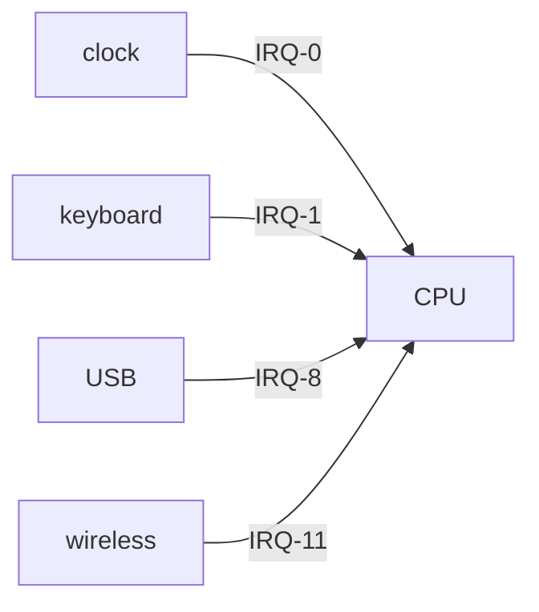
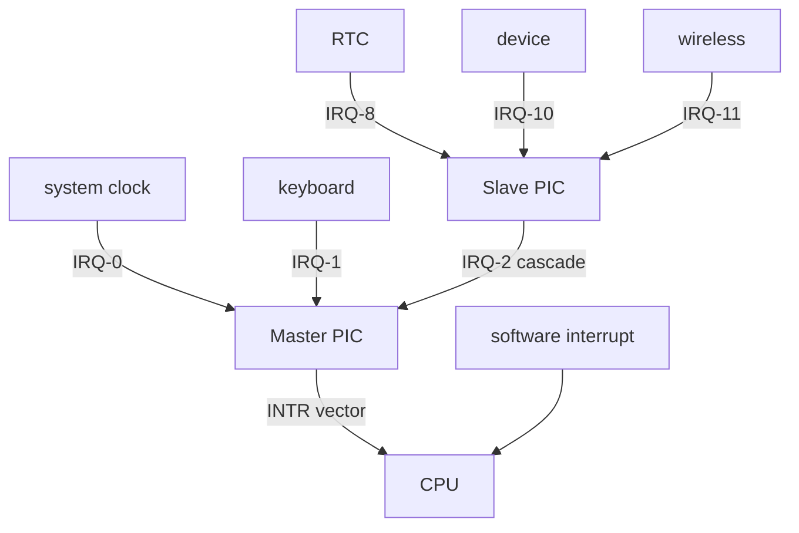
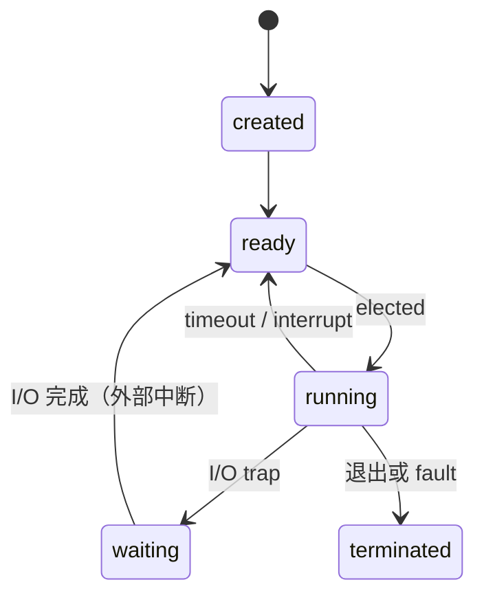

# Week 2：中断、线程、同步

来源：`CSCC69 Week 2 Notes.pdf`

## Program vs Thread

- **Program**：盘上的静态数据
- **Thread**：程序的一次执行实例；同一程序可以有多条线程并发跑

一核通过 **分时** 并发：线程自己 yield（如非阻塞 I/O），或被 **时钟中断** 抢走。这叫 limited direct execution。

```mermaid
gantt
    title 单核上 Thread A / B 交错
    dateFormat X
    axisFormat %s
    section CPU
    A :a1, 0, 2
    B :b1, 2, 4
    A :a2, 4, 6
    B :b2, 6, 8
    A :a3, 8, 10
    idle :crit, 10, 12
    A :a4, 12, 14
```



系统侧：整体更快；用户侧：看起来并行。

## 中断两类

1. **External / hardware**：设备需要关注（异步）
2. **Internal**：syscall、异常、fault（除零、缺页）（同步）

### 笨办法：设备直连 IRQ



硬接线、不灵活，CPU 可能被打断个不停。

### 更好：两片 PIC 级联



PIC 决定何时、哪个设备打断 CPU。共 16 条 IRQ（0–15），有优先级，可 mask。

处理步骤：CPU 收到 INTR → 按向量查 **IDT** → handler 保存现场 → 干活 → 恢复或终止。Linux：`cat /proc/interrupts`；Windows：`msinfo32.exe`。

按键例子：键盘控制器通知 PIC IRQ1 → PIC 决定是否通知 CPU → 向量进 IDT → 停下当前程序 → handler 用 `in`/`out` 问哪一个键 → 写文件等 → 恢复。

## 上下文切换与线程状态

单核同时只有一条 running；若干 ready；若干等 I/O。OS 必须记下状态和执行上下文（寄存器、栈、堆…）。



三种切换场景：

- **Fault**：挂起并终止该线程
- **时钟中断或 syscall trap**：保存上下文，标 ready 或 waiting，从 ready 选下一个，恢复并跑
- **其它 I/O 中断**：做完 I/O，把等待者标 ready，**继续当前程序**（不一定立刻切换）

**TCB** 含：tid、state、registers（含 eip/esp）、user、指向所属 PCB 的指针。OS 维护 ready 队列，以及按 I/O 类型分的多条 waiting 队列。

## 同步

协调多个进程，避免同时碰同一共享数据。失败典型是 **race condition**：结果依赖交错顺序，不确定、难复现。

原笔记 `fork()` 例子：父打印 1、子打印 2，本机可能 `12`，实验室可能 `21`。

### 临界区

用互斥保护共享资源的代码叫 **critical section**。同时只能进一个。入口 `P()`/`wait()`，出口 `V()`/`signal()`。

要求：

1. **Mutual exclusion**（safety）
2. **Progress**：不在 CS 里的人不能永远挡别人；在里面的人最终会离开
3. **Bounded waiting**（liveness）
4. **Performance**：进出开销相对 CS 工作要小

三种原语：

**Lock / Mutex**

- 忙等也可用于 >2 个进程。flag 0=空闲，1=占用。
- `init` 解锁；`acquire` 等到解锁再锁上；`release` 解锁并唤醒等待者。

**Condition Variable**

- `cond_wait(cond, lock)`：放锁、睡到被 signal，醒来再拿锁
- `cond_signal`：叫醒下一个
- `cond_broadcast`：叫醒全部

**Semaphore**

- 非负整数，线程共享。`P`/`down` 等到“开”再减；`V`/`up` 放行。
- 值永远 ≥ 0。每个信号量有等待队列。P 时开则继续、关则入队；V 时有人等就唤醒，没人等则记住这次信号。
- 可能 **deadlock**：A 要 B 的资源、B 要 A 的资源。

## 教材：为什么用线程

1. **并行**：多核把大数组加法切开
2. **重叠 I/O**：一条线程阻塞时另一条还能算或发 I/O

共享数据 + 不受控调度 = race。需要 **atomicity**（要么全发生要么看起来都没发生）。锁把调度从完全混乱变成“这段代码同时只有一人”。

POSIX mutex：`pthread_mutex_lock` / `unlock`，不同数据用不同锁可提高并发。评价锁：互斥、公平/饥饿、性能（无竞争 / 单核竞争 / 多核竞争）。

### 关中断当锁

单核简单，但：用户不该有特权；多核无效；关太久会丢中断；开关中断本身慢。

### 失败的 flag 自旋

```c
while (mutex->flag == 1) ;  /* spin */
mutex->flag = 1;
```

两个问题：中断插在 test 和 set 中间会两人同时进去；自旋浪费 CPU（单核上持锁者甚至跑不了）。

### 硬件原语

- **Test-and-Set**：原子地返回旧值并写成新值 → 可做 spin lock。正确但不公平；单核持锁被抢占时其它人空转一整片时间片；多核短 CS 还行。必须有抢占，否则单核自旋锁无意义。
- **Compare-and-Swap**：若 `*ptr == expected` 则写成 new，返回旧值。
- **Load-Linked / Store-Conditional**：SC 仅当中间没人写该地址才成功。
- **Fetch-and-Add**：ticket + turn 锁，能保证最终轮到每个人。

自旋太贵时：`yield()` 让出 CPU（仍可能饥饿）；更好是 **排队睡眠** 而不是转。Solaris：`park()` 睡觉，`unpark(tid)` 叫醒指定线程。用 TAS 保护「flag + 等待队列」这几条指令（guard 仍是短自旋）。注意必须在 `park()` **之前** 放下 guard，否则死锁；还有 **wakeup/waiting race**（正要睡时锁已被释放）→ `setpark()`：若在 park 前已被 unpark，随后的 park 立刻返回。放锁时可直接把 lock 传给被唤醒者（不必先把 flag 清 0）。

Spin lock 还会造成 **priority inversion**（高优先级自旋等低优先级持锁者）。对策：别用自旋、**priority inheritance**、或大家同优先级。

## 信号量用法（教材）

POSIX：`sem_init(&s, 0, value)`（第二参数 0 = 进程内共享），`sem_wait` / `sem_post`。

- **Binary semaphore（初值 1）** 当锁。有人会把值减到 -1 表示「有一个在等」。
- **排序**：一个线程 wait「某事发生」，另一个做成后再 post。
- **生产者-消费者（有界缓冲）**：`full` = 已有多少项，`empty` = 空槽数，外加 mutex。生产：wait empty → 拿 mutex → 放入 → 放 mutex → post full。消费对称。这样不会 **lost wakeup**。
- **Reader-writer lock**：查找可并发，插入必须独占。
