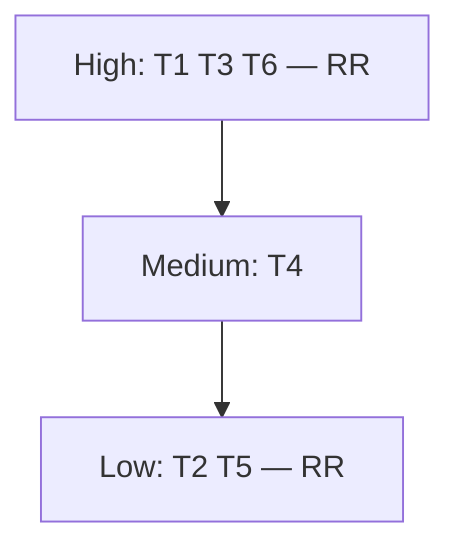

# Week 3：调度

来源：`CSCC69 Week 3 Notes.pdf`

## 问题

n 个 ready 线程、k 个 CPU，分给谁、给多久？还要避免 **starvation**（永远拿不到 CPU 或锁）。饥饿常是调度副作用（高优先级一直压着低优先级），也可以来自同步。

## 指标

| 指标 | 含义 | 越好 |
| --- | --- | --- |
| Throughput | 单位时间完成的线程数 | 高 |
| Turnaround | `T_finish − T_start`（或 `T_completion − T_arrival`） | 低 |
| Response | 从请求到第一次跑：`T_firstrun − T_arrival` | 低 |

次要：CPU utilization、ready 队列平均等待时间。

批处理系统看吞吐和周转；交互系统看响应，用户更喜欢 **可预期** 而不是平均很快但抖动很大。

- **非抢占**：一旦拿到 CPU 就跑到结束（适合批处理）
- **抢占**：可被更高优先级或时间片抢走（适合交互）

## FCFS（非抢占）

按到达顺序，无中断。P1=24，P2=3，P3=3，都在 t=0 到达且顺序 P1→P2→P3：

```mermaid
gantt
    title FCFS
    dateFormat X
    axisFormat %s
    section CPU
    P1 :p1, 0, 24
    P2 :p2, 24, 27
    P3 :p3, 27, 30
```

- Throughput：\(3/30 = 0.1\) jobs/s
- 平均周转：\((24+27+30)/3 = 27\) s
- 平均等待：\((0+24+27)/3 = 17\) s

大作业挡着一串小作业 = **Convoy Effect**。

## SJF（非抢占）

最短处理时间先跑。同一组作业：

```mermaid
gantt
    title SJF
    dateFormat X
    axisFormat %s
    section CPU
    P2 :p2, 0, 3
    P3 :p3, 3, 6
    P1 :p1, 6, 30
```

- Throughput 仍 0.1
- 平均周转：\((30+3+6)/3 = 13\) s
- 平均等待：\((0+3+6)/3 = 3\) s

问题：必须预先知道运行时间。批处理容易，交互系统做不到。后来者若更短，非抢占 SJF 仍会 convoy（A 已开跑 100s，B/C 后到也得等）。

## SRTF / STCF（抢占）

新来的 burst 比当前剩余时间更短就抢占。笔记例子：

| 进程 | 到达 | burst |
| --- | --- | --- |
| P1 | 0 | 7 |
| P2 | 2 | 4 |
| P3 | 4 | 1 |
| P4 | 5 | 4 |
| P5 | — | （按笔记时间线） |

时间线（与笔记一致）：

- 0–2：P1（剩 5）
- 2：P2 到，burst 4 < 5 → 切 P2
- 2–4：P2（剩 2）
- 4：P3 到，burst 1 最短 → P3 跑完
- 5：P4 到；P2 剩 2 最短 → P2 跑完（5–7）
- 7–11：P4
- 11–16：P1

优点：优化等待。缺点：大作业（P1）可能 **饥饿**。

## RR（抢占）

每人都有 **quantum**，用完排到 FIFO 队尾。公平、交互等待短；**没有优先级**。量子必须 ≫ 上下文切换成本，又不能大到退化成 FCFS。典型 1–100 ms。RR 响应好、周转差。切换成本不只是存寄存器，还有 cache/TLB/分支预测被冲掉。

## MLQ

每线程一个固定优先级，高的先跑；同优先级 RR。

问题：低优先级饥饿；高优先级也可能反转饥饿；优先级怎么定？

### 优先级反转

T1 低持锁 L → T2 中抢占猛跑 → T3 高要 L 被堵 → 调度只看见 T2 是最高 **ready** → T3 饿死。

**Priority donation：** T3 把高优先级借给 T1 → T1 跑完放锁回到低 → T3 立刻跑。

防低优先级饥饿：等待越久优先级升高，或 CPU 用得越多优先级下降。用观测到的 CPU 使用来定优先级。

## MLFQ（图灵奖相关）

和 MLQ 一样分层，但优先级 **随行为变**。

1. Priority(A) > Priority(B) → 只跑 A
2. 同优先级 → 该层 quantum 做 RR
3. 新作业进最高层
4. 某一层的时间配额用尽（不管中间 yield 几次）→ 降一层
5. 每隔周期 S，所有作业抬回最顶层（防饥饿、适应工作集变化）

交互型经常让出 CPU → 留在高层；CPU 密集 → 沉到底层。用历史预测未来。

## 教材：Limited Direct Execution

直接在 CPU 上跑用户程序又快又能虚拟化，但要解决：

1. **受限操作**：用户态不能随便 I/O。特权在 kernel mode。用户用 **trap** 进内核做 syscall，做完 **return-from-trap**。启动时 OS 填 **trap table**。用户只能提供 syscall **编号**，不能跳到任意内核地址。硬件会把 PC/flags 压到该进程的内核栈。
2. **夺回 CPU**：合作式（yield / syscall / 非法操作）不可靠。必须用 **timer interrupt**。然后 scheduler 决定是否切换；切换 = 保存/恢复通用寄存器、PC、内核栈指针。

早期作业假设：同样长、同时到、跑完才停、只用 CPU、运行时间已知。逐步放宽得到 FIFO → SJF → STCF → 引入响应时间后得到 RR。
