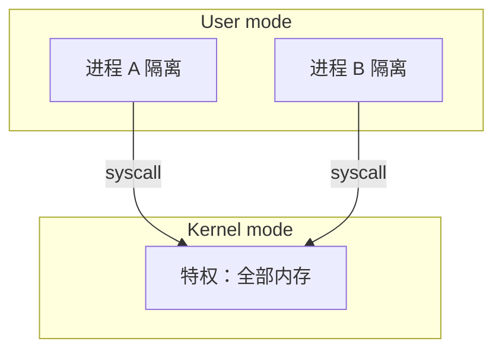
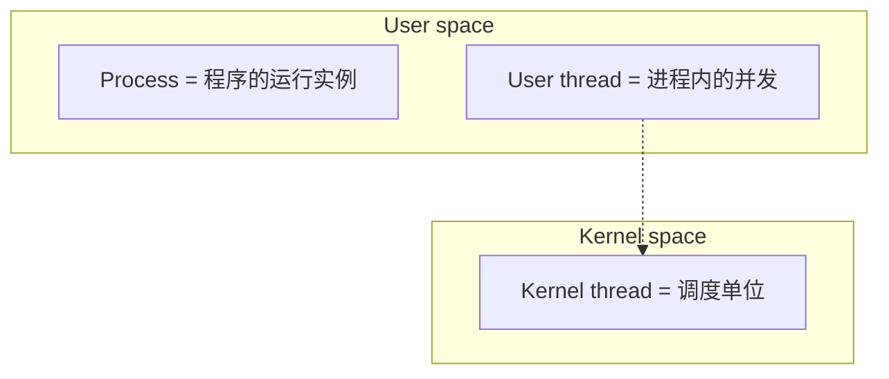
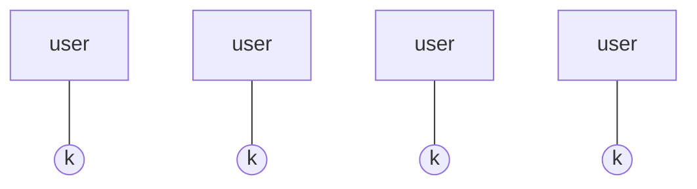
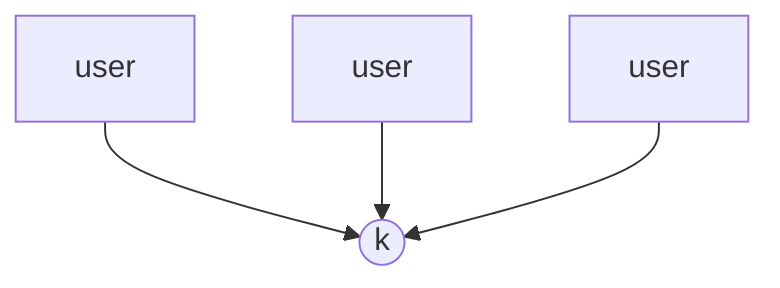
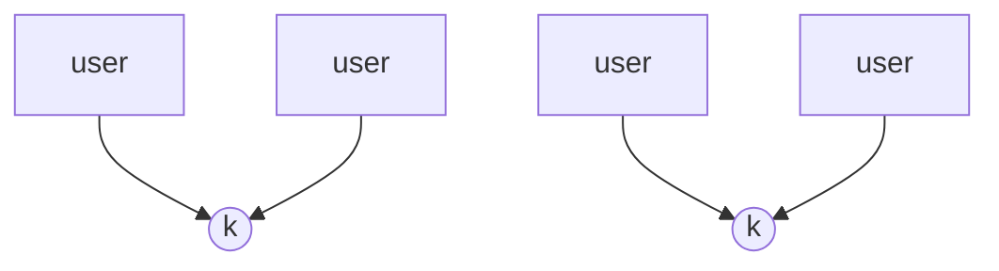

# Week 4：保护、系统调用、进程 API、线程模型

来源：`CSCC69 Week 4 Notes.pdf`

## 为何要保护

用户程序以进程形式互相隔离。内核特权访问全部内存。进程只能经 **system call** 要资源。虚存把用户看到的地址映射到物理内存，内核管所有进程的映射。

系统调用像“内核 API”，六类与 Week 1 相同。用户不能直接碰设备（USB / 蓝牙 / SSH 键盘），必须 trap 进内核。

## PCB

记录：pid / ppid、user（可选）、地址空间、打开文件等。进程由另一进程创建。启动时内核创建 **root process**（pid 0），简单 OS 可能是 shell，GUI 则是 Window Manager。

## Unix：fork / exec / wait / exit

**`fork()` 创建新进程：**

1. 新建并初始化 PCB
2. 新建地址空间
3. 拷贝父地址空间（PCB 除外）
4. 内核资源指向父用的那些（如打开文件）
5. 创建内核线程并放入 ready 队列

适合子进程要基于父数据合作。成功时：父得到 child pid，子得到 0；失败返回负数。谁先跑由调度器决定 → 可能 race。

**`exec(prog, argv)` 不创建进程**，只在当前进程里换程序：

1. 停下当前
2. 把 `prog` 装进地址空间
3. 初始化硬件上下文和参数
4. PCB 放回 ready

多数 `fork` 后面紧跟 `exec`，合称 **spawn**。这就是 shell 跑命令的方式。`wait()` 让父等至少一个子结束。`exit()` 终止自己。

分开 fork/exec 的好处：中间可以改环境（重定向、管道），这是 Unix shell 的关键。

## Windows

因安全顾虑不用 fork+exec，而是 `CreateProcess(prog, args)`：新建 PCB 和地址空间、装入程序、拷参数、从 `main` 开始、放入 ready。对应 `WaitForSingleObject`、`ExitProcess`。

## 为何还要用户线程

创建进程、切上下文、IPC 都贵。现代 OS 分开：

- **Thread**：进程内的顺序执行流（调度单位）
- **Process**：地址空间和其它属性

线程绑定一个进程；进程可有多线程。好处：响应（后台等事件时界面还能动）、共享内存协作、省 PCB/整上下文、多核可扩展。

### POSIX 风格 API

- `tid thread_create(void (*fn)(void *), void *)`：分配 TCB 和栈，把 fn/args 放栈上，放入 ready
- `void thread_exit()`
- `void thread_join(tid)`

真正 POSIX：`pthread_create(&t, attr, start_routine, arg)`（void* 以便传任意参数）、`pthread_join`。锁必须初始化（`PTHREAD_MUTEX_INITIALIZER`）并检查返回值。CV 必须持关联锁再 wait/signal。

## 三种多线程模型

**1:1（kernel / native threads）**

内核管调度和所有线程操作。调度能力强，但每次操作都进内核，**慢**。

**N:1（user-level / green threads）**

一进程一个内核线程。库自己调度，轻、快；但一条阻塞全体阻塞，也上不了多核。

**N:M（hybrid）**

折中：库把 N 个用户线程映射到 M 个内核线程。实现复杂（内核+用户都要改），用户级切换可避免 syscall。
