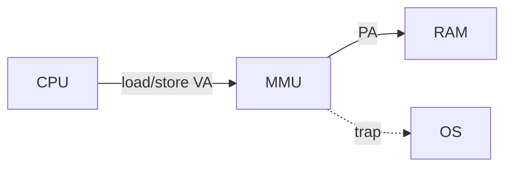
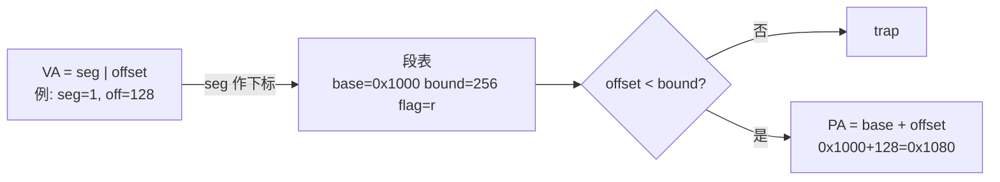
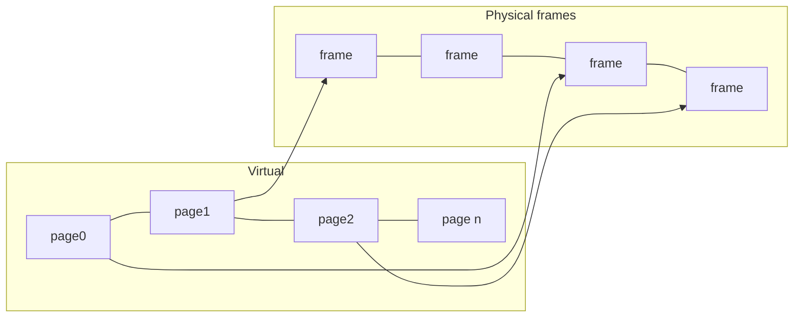
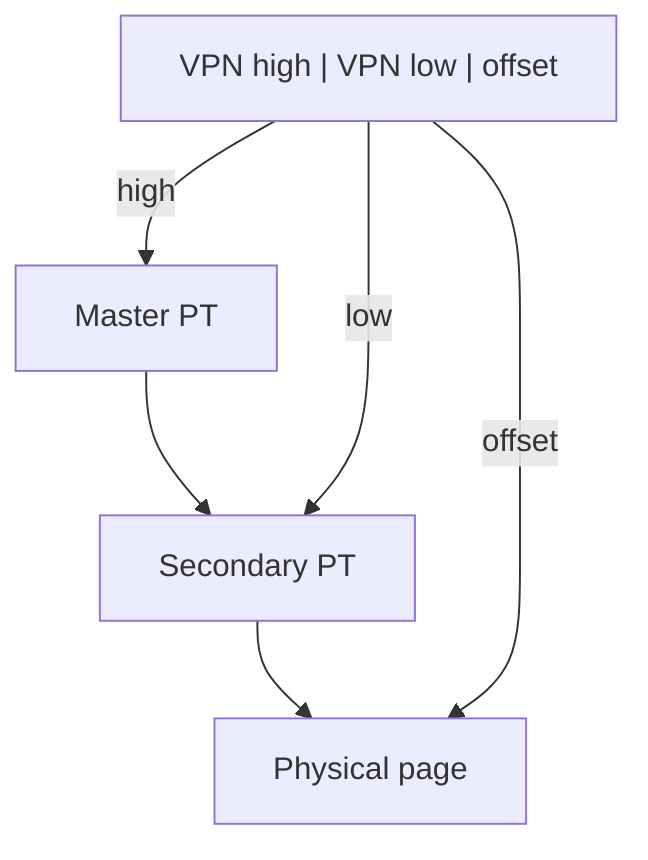

# Week 5：虚拟内存、分段、分页、TLB

来源：`CSCC69 Week 5 Notes.pdf`

## 为什么要虚存

栈/堆乱放问题不大，但函数地址写死在二进制里，程序不能随便搬家。

- 编译器：符号 → 编译单元内可重定位地址
- 链接器：目标文件 → 可执行文件里的逻辑绝对地址

**Load-time linking**（装载时再改引用）解决不了：运行中怎么搬？没有足够连续空闲区怎么办？程序如何互不干扰？

共享物理内存的三个问题：**Transparency**（不该依赖特定物理地址，还常要大块连续）、**Resource exhaustion**（所有进程之和 > RAM）、**Protection**（A 不能偷看/改 B）。

虚存目标：每程序私有地址空间；看起来比物理内存大；在进程间分配稀缺内存；强制保护。

术语：程序（连内核）用 **virtual address**；真正内存用 **physical address**。**MMU** 在 CPU 里，用特权指令配置，把 VA 译成 PA，给出每进程的 address space。运行时重定位，进程可在内存里搬，也可 swap 到盘。

三条实现路：基本翻译（base/bound）→ 分段（旧）→ 分页（新）。

## Base and Bound

两个特权寄存器。每次 load/store/jump：

1. `PA = VA + base`
2. 检查 `0 ≤ VA < bound`，否则 trap

换进程必须重装这两个寄存器。

优点：硬件只要两寄存器；加法和比较可并行。缺点：进程变大很贵；无法共享代码/数据 → 用分段（代码、栈、数据分开）。

## 分段

每进程一组 base/bound（段表），地址空间由多个段拼成，可按段共享/保护。

x86 把段号放在 CS/DS/SS/ES/FS/GS。

优点：稀疏；易共享；不必整进程都在内存。缺点：翻译有开销；**外部碎片**（大小不一的洞）。

- 外部碎片：可变大小块留下许多小洞
- 内部碎片：固定大小块内部浪费

## 分页

内存切成固定页（通常 4KB），消灭外部碎片。每进程一张 VPN→PPN 映射，按页共享/保护。

平均内部碎片约每“段” 0.5 页。VA = **VPN（高位）+ offset（4KB 时低 12 位）**。

PTE 字段：Modify（写过）、Reference（读或写过）、Valid、Protection（rwx）、PPN。

优点：空闲页链表分配简单；换出块大小一致，valid 位检测缺页，页大小对齐磁盘块。缺点：仍有内部碎片；每次访存 ≥2 次引用（用 TLB 缓存）；页表本身很大：32-bit、4KB 页 → \(2^{20}\) 个 PTE × 4B = **4MB/进程**，25 个进程就是 100MB → 要把页表再分页。

### 两级页表

只映射真正在用的部分。VA 三部分：master 页号 → 二级表；secondary 页号 → 物理页；offset。

查找次数：一级 1 lookup+1 fetch；两级 2 lookup+1 fetch；64-bit 四级 4 lookup+1 fetch。

## TLB

硬件里缓存 VPN→PTE（不是最终 PA），通常 4-way 到全相联，32–128 项，一轮查完。利用局部性，命中率目标 ~99%。

查找步骤（硬件）：

1. 用页号查 TLB
2. 命中则取出 PTE
3. 检查保护位
4. PTE 给出物理帧
5. 帧号+offset → PA
6. 读内存把值给 CPU

TLB miss：没有该项，或有项但保护位不允许。

## Swapping / Demand paging

盘当更大虚存。内存满了要驱逐一页到 **swap/backing store**。Demand paging：用到才从盘拷进来；进程开始时可以一页都没有。

缺页后 OS 选受害者（见 Week 6 置换算法）。
