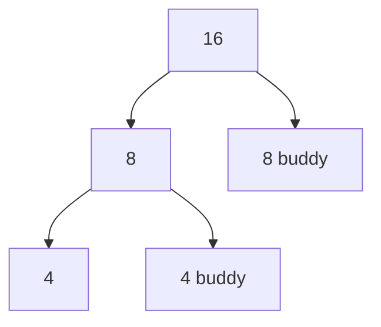
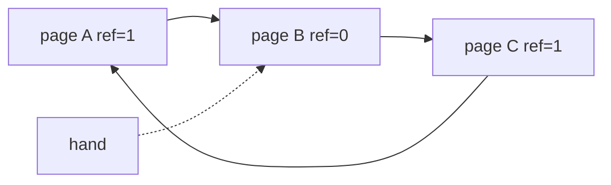

# Week 6：堆分配与页置换

来源：`CSCC69 Week 6 Notes.pdf`

## 两类分配

| | 静态 / 栈 | 动态 / 堆 |
| --- | --- | --- |
| 大小 | 固定 | 可变 |
| 例子 | `char name[16];` | `malloc(16)` |
| 时机 | 编译期 | 运行期 |
| 特点 | 受限但简单快 | 通用但难 |

`malloc` 返回至少 size 字节或 NULL；`free` 释放。`free` 会留下洞 → **碎片**（有空闲却用不了）。碎片要两个条件：对象寿命不同 **且** 大小不同。

分配器能做：跟踪已用/空闲。不能做：控制请求顺序/大小，也不能预知未来。好分配器避免 compaction、尽量少碎片。理论：任何算法都存在能把它打成严重碎片的请求流。

### Bitmap vs 链表

- Bitmap：每分配单元 1 bit（0 空 1 占用）。找连续 N 个 0 要扫描，慢。
- Implicit list：每块头记录 size+状态，找空闲线性于总块数。
- Explicit list：空闲块做成双向链表。
- 相邻空闲块要 **coalesce**。

### 放置算法

1. **First-fit**：第一个够大的（可从上次结束处继续）
2. **Best-fit**：最接近请求大小
3. **Worst-fit**：最大块
4. **Quick-fit**：常见尺寸多条空闲链
5. **Buddy**：向上取整到 \(2^k\)

First-fit 简单常最快，但开头会积很多碎块。Best-fit 利用率相近，剩下的洞往往太小。

### Buddy（Linux 用）

块大小 \(2^k\)，维护 n 条空闲链。递归切大块；释放时若 buddy 也空就合并。一对 buddy 地址只差一个 bit。分配/合并快，对 \(2^n\) 请求没有外部碎片，物理页保持连续。

## 页置换

Swap：盘模拟更大虚存。缺页 → 把页从盘装进帧。没有空帧或碰到进程帧上限 → **驱逐**。目标：选受害者使缺页率最低。用 **reference string** 数 fault 来评价。

三种主算法：FIFO、LRU、Second Chance（LRU 近似）。

### FIFO

赶最早进来的。更多物理帧 **不保证** 更少 fault → **Belady 异常**。OPT/Belady 算法：淘汰最久以后才用的页，最优但要看未来，只当比较基准。

示例（3 帧，串 `1 2 3 4 1 2 5 1 2 3 4 5` 是教材常见串，用来演示 FIFO 异常；笔记 PDF 里用 3 帧画逐步表格）。

### LRU

赶最久没被用的。实现：

1. 每次访问在 PTE 盖时间戳，miss 时扫全表找最老 → 访存翻倍
2. 双向链表，访问移到尾、miss 砍头 → 太贵

所以要近似。

### Second Chance / Clock

用硬件 **accessed / reference bit**。

**FIFO 风格 second chance：** 链表 + head/tail。命中置 accessed=1。Miss：head 若为 1 则清 0 并扔到尾，直到找到 0 再换出。效果好但每次 miss 要搬节点。

**Clock：** 环形链表 + 一根指针。

命中置 1。Miss：hand 指向 1 则清 0 并往前；指向 0 则换出、装新页、再往前。不必每次 miss 旋转整条链。

其它：Random（简单、避开 Belady 异常）、LFU/MFU（都不常用）。

## 给进程多少内存

- **固定空间 / local replacement**：每进程有页上限，只换自己的页
- **可变空间 / global replacement**：一进程可以连累别人

**Working set** \(WS(t,w)=\{P \mid P 在 (t-w,t) 被引用\}\)。大小随局部性变。希望 WS 就是“为避免狂缺页该留在内存的页”。难处：w 难选、WS 何时变难判。日常问“Firefox 要多少内存”其实在问 WS 大小。

**PFF：** fault 率高于高阈值就加页，低于低阈值就收回。难区分“局部性变了”和“WS 变大了”。

**Thrashing：** 系统大部分时间在进进出出页。原因：坏置换算法，或物理内存不够。

Windows XP：local + 每进程 FIFO，默认 50 页，按 fault 率调 WS，缺页时预取周围一簇。Linux：global + 改进 clock，指针扫过页会老化，长期不用变成 0。

## 教材机制补充

Swap space 大小决定同时能“在用”的页上限。文件支持的代码页可以直接从二进制再读，不必占 swap。PTE 加 **present bit**：0 表示在盘上，访问即 **page fault**。Handler 几乎总在软件里：从 PTE 里的盘地址读回，标 present，填 PFN，重试指令（可能先再 miss 一次 TLB）。等盘时进程 **blocked**，可跑别人。
