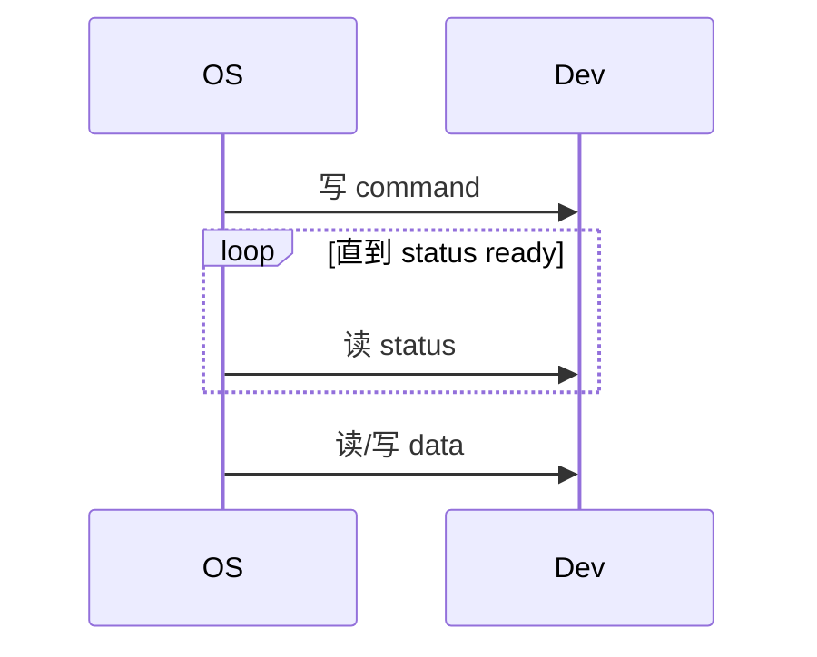
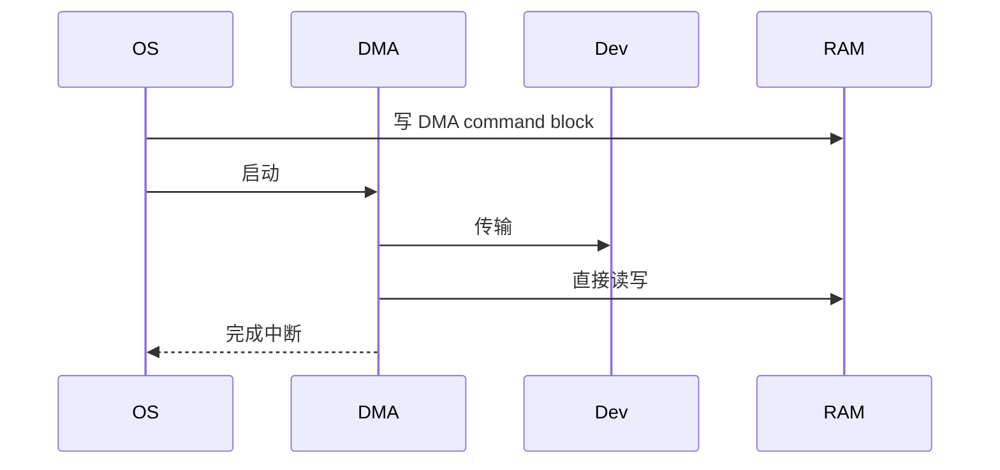
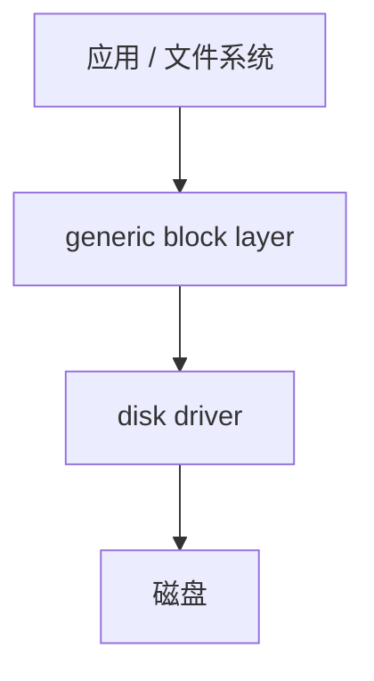

# Week 7：I/O、DMA、磁盘与 SSD

来源：`CSCC69 Week 7 Notes.pdf`

## 设备怎么接到机器上

设备种类多、新设备不断出现。连接方式：

- **Port**：连接点（如串口）
- **Bus**：菊花链或共享访问（PCI、USB）
- **Controller / host adapter**：操作 port/bus/设备的电子学，可集成或独立（Northbridge、Southbridge、GPU、DMA、NIC…）

每个设备三类寄存器，OS 通过读写它们控制设备：

1. Status：当前状态
2. Command / Control：下令
3. Data：传数据

访问方式：

- **I/O ports**：x86 的 `in`/`out`
- **Memory-mapped I/O**：寄存器出现在内存地址上，用 load/store

## Polling vs Interrupt

**Polling：** 反复读 status 直到就绪。简单，但 CPU 空转。

**Interrupt：** 把请求 I/O 的进程睡掉并切换；设备完成发中断叫醒等待者。CPU 利用率更好。

中断并非总最好：设备极快时中断反而慢。高包速率下中断比处理还贵，handler 优先级高，极端会 **receive livelock**（100% 时间在 handler 里，业务零进展）。实践：**自适应** 在中断和轮询间切换。

## DMA

CPU 拷大块数据到设备很浪费。**DMA**：CPU 只发控制，把 buffer 地址交给设备，设备自己搬。可 scatter/gather。

设备协议五花八门（port / mmap、polling / interrupt、PIO / DMA 任意组合）。解决：公共接口 + 每设备一个 **driver**（Linux 约 70% 代码是驱动）。文件系统只对 generic block layer 发块读写。

## HDD

- **Platter**：镀磁铝盘，两面都是 surface
- **Spindle**：电机，RPM 常见 7200–15000
- **Track**：面上的同心圆
- **Cylinder**：同一半径上各面的 track 叠在一起；磁头沿 cylinder 读写，通常同时只有一个头活动

接口呈现线性扇区数组。历史上 512 B，现在 “advanced format” 4 KB。扇区写入原子（即使掉电）。逻辑扇区号到物理的映射 OS 看不见。

每次读写三步：

| 步骤 | 做什么 | 量级 |
| --- | --- | --- |
| Seek | 臂移到目标 track：加速→匀速→减速→settle | settle 0.5–2 ms，整次 seek 常 4–10 ms |
| Rotate | 转到目标扇区 | 7200 RPM 一圈 8.3 ms，平均约 4.15 ms |
| Transfer | 读写表面 | 100+ MB/s，512 B 约 5 µs |

Seek、旋转慢，传输快。**顺序** 访问被传输主导（快）；**随机** 被 seek+旋转主导（慢）。

磁盘调度：FCFS、SSTF（最短寻道）、SCAN（电梯）。

## SSD

全固态，靠电荷记数据（像 RAM）。同一套线性扇区接口；无机械 seek/旋转，更快、更省电。更贵；电荷会磨损（MLC ~1 万次擦、SLC ~10 万）。需要 **FTL** 做 wear leveling，对性能影响大。
