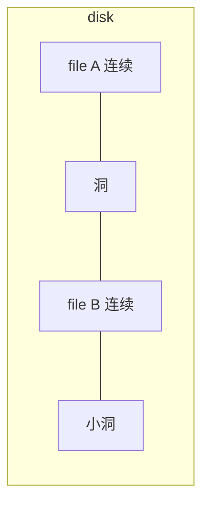
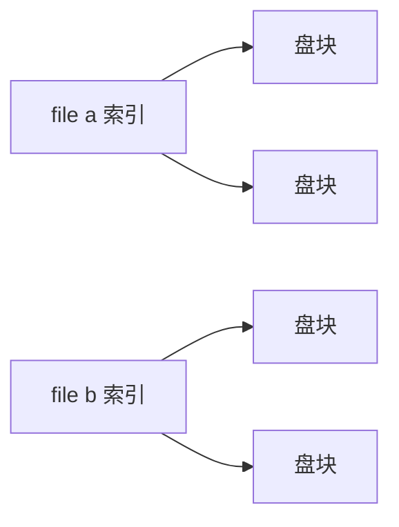
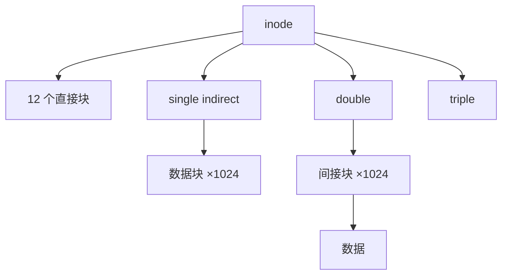

# Week 9：文件系统、inode、目录、缓存与保护

来源：`CSCC69 Week 9 Notes.pdf`

## 抽象

文件系统指定磁盘类型，向 generic block layer 发块读写。目标：给辅存一个 **file** 抽象；用目录组织；进程/人/机器间共享；保护。

文件 = 盘上有名字的字节 + 属性（内容、大小、所有者、时间、保护）。类型：FS 认识的（块设备、字符设备、链接、FIFO、socket）以及库/OS 认识的（文本、图、`.so`/`.dll`、可执行）。Windows 用扩展名；Unix 用 magic number（如 `#!`）。Unix：**everything is a file**。

访问方式：顺序、随机、索引（数据库）、记录（数据库）。

| Unix | Windows |
| --- | --- |
| `create` / `open` / `read` / `write` | `CreateFile` / `ReadFile` / `WriteFile` |
| `sync` / `seek` / `close` / `unlink` | `FlushFileBuffers` / `SetFilePointer` / `CloseHandle` / `DeleteFile` |

设计约束：多数文件很小；盘空间大多在大文件里；很多 I/O 打向大文件；既要好的顺序也要好的随机。跟踪文件块的结构叫 **inode**，inode 自己也在盘上。

## 连续分配

像分段：创建时预知长度一次分完。Inode 只存位置+大小。简单、顺序/随机都快；**外部碎片**。

## 链表分配

空闲块链表；inode 指向第一块，每块带下一块指针。易增长、无外部碎片；随机极慢（要顺着走），指针还破坏块对齐。

## DOS FAT

把链接从数据块里拿出来，放到固定大小的 **File Allocation Table**。仍要 chase 指针。

- FAT16 表项 16 bit → 最多 65536 项
- 512 B 块 → FS 最大 32 MB
- 开销 \(2/512 \approx 0.4\%\)
- 可靠性：盘上存 FAT 副本
- 根目录在盘上固定位置

## 索引分配

每文件一张块指针表；表在创建时分配，数据块按需从空闲表拿。顺序/随机都容易；表本身要一大块连续空间。

## Unix 文件系统布局

物理：**sector 512 B**。逻辑：**block**（笔记例子 4 KB）。空间按块分配：

- **D**：文件/目录内容
- **I**：inode 表
- **d**：数据块空闲位图（每块 1 bit）
- **i**：inode 空闲位图
- **S superblock**：magic、位图和 inode 占用多少块

笔记算例：64 个 4KB 块 = 256 KB 物理；8 块保留 → 224 KB 数据。inode 256 B，5 块 inode 表 → 80 个 inode。inode 32 的扇区：

1. 偏移 \(32 \times 256 = 8192\)
2. 加 inode 表起始 12 KB → 20480（20 KB）
3. \(20480 / 512 = 40\) 号扇区

### 多级索引

15 个直接指针 → 最大 \(15\times 4\) KB = 60 KB，浪费很多空表项。Unix：12 个直接 + 一级 + 二级 + 三级间接。

- 仅直接：\(12 \times 4\) KB = 48 KB
- +单间接：\((12+1024)\times 4\) KB ≈ 4 MB
- +双间接：再加 \(1024^2\) ≈ 4 GB
- +三间接：再加 \(1024^3\) ≈ 4 TB

（间接块里指针个数 = 块大小/4 = 1024，当块=4KB。）理由：多数文件很小（最常见 ~2K），平均在涨（~200K），多数字节在大文件里；目录通常很小。

## 目录

对用户：用名字组织；对 FS：把逻辑组织从物理布局里解开。Unix 目录就是文件 + C 库高层接口（`opendir`/`readdir`）；Windows 有显式目录 API。

历史：全系统一个目录 → 每用户一个 → **层次命名**（树，有链接则是图）。目录 inode 类型位为 directory；用户可读，只有特殊 syscall 能写。Inode 描述块在哪；目录是文件，所以 inode 也描述目录块在哪。

打开 `/one`：

1. Superblock 找到 `/` 的 inode
2. 打开 `/`，找名字 `one`
3. 得到 `one` 的 inode 盘块号
4. 读 inode
5. inode 给出第一数据块
6. 读该块

相对路径相对 **cwd**。Shell 还有 `PATH`（`A:B:C`）。`./foo` 显式当前目录。

**硬链接**：多个目录项指向同一 inode，有链接计数；全删光才释放数据。**软链接**：存目标名字，目标可被删掉或不存在；inode 有 symlink 位，FS 自动翻译。

## 缓冲与预读

**File buffer cache**：系统级缓存文件块，读起来像内存。和 VM 抢内存，常用 LRU。写：应用常假设已落盘所以写显得慢。OS 通常 **write-back**：未提交队列，约 30s 刷一次（期间多次改只写一次；`/tmp` 里删掉可能零 I/O）。崩溃会丢这 30 秒；`fsync` 可强制。

**Read ahead**：预测下一块，与计算重叠。对顺序文件很赚；块要尽量连续。

## 共享与保护

并发读/写语义、用什么协调，以及 **protection**。保护系统回答：某 subject 对某 object 的某 action 是否允许。

- **ACL**：每个对象一份「谁能干什么」
- **Capability**：每个主体一份「能对哪些对象干什么」

大楼比喻：ACL = 每栋楼门口名单；Capability = 每人一串钥匙。Capability 好比钥匙，易转手；ACL 更好管、易授予/撤销。撤销 capability 要跟踪所有持有者。对象被很多人共享时 ACL 会膨胀。
