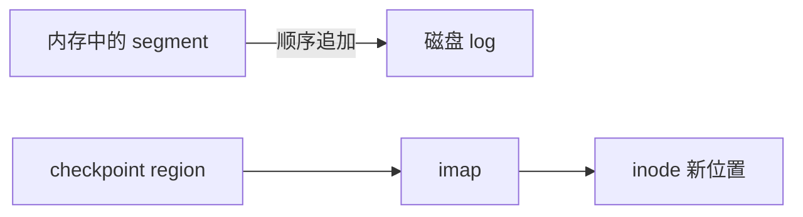

# Week 10：FFS、LFS 与 Journaling

来源：`CSCC69 Week 10 Notes.pdf`

## 原始 Unix FS 为什么慢

顺序传输只能吃到磁盘峰值约 **2%**（20 KB/s）。三个原因：

1. **块太小（512 B）**：索引巨大、间接块多、一次只能搬一块，带宽低
2. **空闲表无组织**：连续逻辑块物理上不相邻，顺序访问也要 seek；老化后更碎
3. **局部性差**：inode 离数据远；同一目录的 inode 也不在一起 → `ls` 很惨

### 问题 1：块太小 → fragment

更大块提高带宽，但内部碎片增加。**Fragment**：大块可切成 2/4/8 个小片，只给小文件或文件尾。建 FS 时定 fragment 大小。大文件传输快，小文件浪费少。

### 问题 2：空闲表 → bitmap

每位表示一块是否空闲，整张图通常常驻内存，容易找连续块。盘越满，找越慢越差。

分配「靠近块 x」：看 `bmap[x/32]` 附近。盘很空时附近几乎总能找到。定期 defrag 会占满带宽；把相邻空闲硬维护在链表上也很贵。

### 问题 3：局部性 → cylinder group

连续 cylinder 收成一组。组内访问不必长距离 seek。相关的放一组，不相关的分开：

- 顺序块放相邻扇区
- inode 和它的数据同组
- 同一目录的 inode 同组

每组就像一个迷你 Unix FS。

这就是 **BSD Fast File System (FFS)**。

## 崩溃：一次操作改很多扇区

硬盘保证 **扇区** 原子写入，但一次 FS 操作会改 bitmap、inode、数据块多个扇区。掉电很容易不一致。

### 方案 1：fsck

启动时扫一遍修不一致。修不完所有情况；大盘可能跑几小时；每次 reboot 都要跑。

### 方案 2：LFS / Copy-on-Write 日志

把盘当磁带：在内存攒一个 segment（含 inode），再 **顺序追加** 写到空闲位置，不覆盖旧数据。顺序写带宽最好。

旧 Unix 的 inode 表在固定位置；LFS 把 inode 打散，用 **imap** 记 inode 号→盘上位置。固定入口是 **checkpoint region (CR)**，指向最新 imap 碎片，约每 30s 更新以免太慢。

崩溃恢复：CR 必须原子更新。保留 **两个 CR**，写分三步：

1. 写带头 timestamp #1
2. 写 CR 体
3. 写末块 timestamp #2

若 #1 比 #2 新，说明写到一半。选最近且合法的 CR。成功 checkpoint 之后的 log 在崩溃时丢掉。

垃圾回收：旧版本留在盘上。cleaner 看 segment 版本，空闲时或空间不够时把还活着的块压紧。

### 方案 3：Journaling / Write-Ahead Logging（ext3）

先把「打算做什么」写到日志，再改真正的 FS。崩溃后回放日志做 **recovery**。
