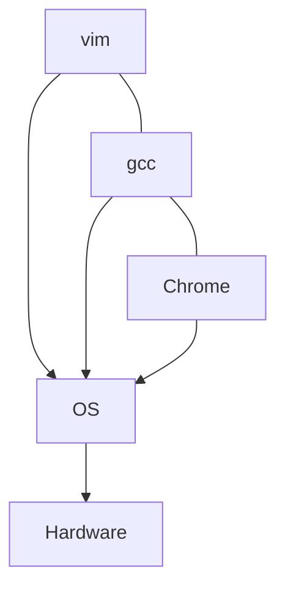
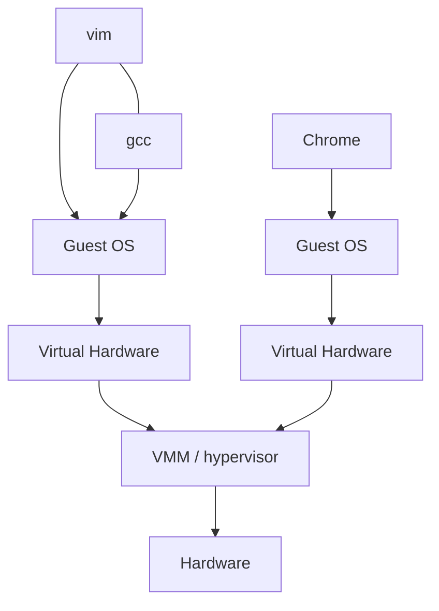

# Week 11：虚拟化与 VMM

来源：`CSCC69 Week 11 Notes.pdf`

## OS 在干什么

OS 在应用和硬件之间：抽象硬件使应用可移植；让有限 CPU/内存看起来又大又独占；保护进程和用户。

若进程抽象长得像硬件本身：

| 进程抽象 | 硬件 |
| --- | --- |
| 非特权寄存器和指令 | 全部寄存器和指令 |
| 虚存 | 虚存+物理内存、MMU、TLB/页表 |
| 错误和信号 | trap、中断 |
| 文件/目录/裸设备 | PIO、DMA、中断访问的 I/O 设备 |

## VMM

一层薄软件，导出「看起来像硬件」的 VM，让客户软件以为自己控制整机。同一台物理机跑多个 OS。

70 年代大型机就有；80 年代 PC 便宜后冷掉；Disco / Mendel Rosenblum → VMware 再热。云（EC2）把它变成日常。

为什么用：软件兼容；吃满强大硬件；隔离；封装（VM 不绑死物理机）；调试/仿真/安全/容错。

服务器切分：N 台 → 1 台，省电省冷却。隔离：打印服务挂了不影响邮件；攻破一个 VM 拿不到另一个的数据。还可混跑 Linux/Windows。

要求：**Fidelity**（OS/应用基本不用改）、**Isolation**、**Performance**（多层软件，开销要小）。要虚拟化的正是 CPU、事件（中硬/软中断）、内存、I/O。

和 OS 比：手法类似但更简单（VMM 更小）；抽象不同（硬件接口 vs OS 接口）。

## 实现路径

**完全模拟（Bochs）**：CPU 取指-译码-模拟；内存当数组并模拟 MMU；设备/PIO/DMA/中断全仿真。太慢：CPU/内存约 100×，设备约 2×。

**Trap-and-emulate：** 多数指令在用户/内核态一样（如 `incl %eax`），可直接在 CPU 上跑。把客户 OS 放在 **非特权** 用户态；特权指令 trap 进 VMM 再模拟。安全靠已有保护机制。

中断：OS 以为自己管中断表。真实中断先到 VMM（内核态），再用该 VM 的「虚拟中断表」注入。有的中断可 shadow。

## 虚拟内存

OS 以为自己管页表。VMM 必须：把硬件页分给 VM；控制映射（OS 只能映射到 VMM 给它的页）。硬件 walk 页表的 TLB 让这件事很难，VMM 必须控制 OS 对页表的访问。

**直接映射：** MMU 用客户页表；OS 可读，但写 PTE 必须经 VMM 校验。要 patch 客户 OS 的页表更新。

**多一层：**

1. **Machine**：真正 DRAM
2. **Physical**：OS 以为的连续「物理内存」（可能底下不连续）
3. **Virtual**：普通虚地址空间

**Shadow page tables：** VMM 维护 VA→machine 的表，切 VM 时装进 MMU。客户 VA→PA 表只读映射；OS 一写就 trap，VMM 同时更新 shadow 和客户表（memory tracing）。MMIO 设备页要读写都保护。

内存策略往往很简单：静态给 512 MB 一辈子（OS 不适应物理内存大小变化）；不给 VM 换页。更复杂：**balloon driver** 在客户 OS 里「充气」抢走页（从该 OS 的 VM/文件缓存偷），把硬件页让给别的 VM。

## 虚拟 I/O

OS 不能再直接碰设备：`in`/`out` trap 进 VMM；MMIO 用 tracing。VMM 模拟设备：中断告诉 CPU 模拟器；DMA 则在该 VM 的「物理内存」里拷数据。
