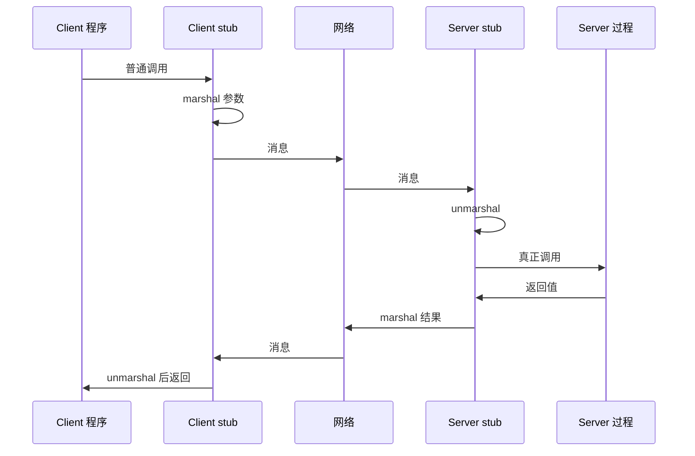

# Week 12：分布式系统与 RPC

来源：`CSCC69 Week 12 Notes.pdf`

## 什么是分布式系统

网络上合作的一组进程，对用户像一台电脑。共享状态、并发执行、单机可挂而不让整体停。例子：GFS、BigTable、MapReduce、Hadoop、ZooKeeper。

耦合程度：

1. **松**：email、web、FTP、SSH
2. **中**：RPC、NFS
3. **紧**：AFS 这类分布式文件

承诺：更高可用、更耐丢失、更好安全、可并行/扩展、便宜、用户能控制一部分、易协作。

现实往往相反：依赖每台都活；任一崩溃可能丢数据；攻击面变成全世界；还要在网上协调多份共享状态。

## 需求：Transparency

把复杂性藏在简单接口后面：位置、迁移、副本数、有多少用户、并行加速、故障。协作需要处理机之间能通信。

## Client / Server

客户先 **bind**（定位并连接），再发带数据的请求，服务器回响应。注意口语里「服务器」既指程序也指那台机器。

命名：`(host, id)` 标识进程/端口；以太网地址；IP；**DNS** 把名字解析成 IP。

## 通信

1. **UDP 原始消息**：自己打包格式、组包拆包、可能要等多条消息。太底层。
2. **TCP 可靠消息**
3. **RPC / RMI**：像本地过程调用。服务器用 **IDL** 导出过程；stub 编译器生成客户/服务器两侧 stub。

Stub 是胶水：客户端打包、发送、等待、拆结果；服务端拆包、调过程、打包返回。**Marshalling** = 把参数塞进消息。DCOM、CORBA、Java RMI 本质都是 RPC；NFS 也是一组 RPC。
