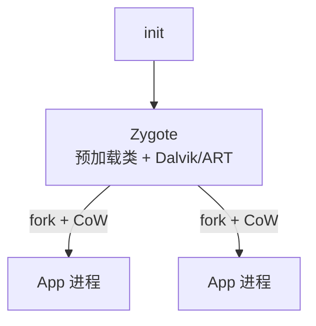

# Week 13：移动 OS、Android、访问控制

来源：`CSCC69 Week 13 Notes.pdf`

## 移动 OS 简史与约束

早期 PDA → Symbian（2000，Ericsson R380，只跑专有程序）→ Palm OS / Windows CE / Blackberry → **iPhone 2007**（4GB 闪存、128MB DRAM、多点触控；2008 App Store 才允许第三方）。

约束：内存、存储、电池、算力、带宽、尺寸都紧。用户更在乎 **延迟** 而不是吞吐（启动要好几秒会疯）。环境在变（信号忽强忽弱）。

桌面：一个应用 ≈ 一个进程。手机不是：

- 看见某个 app ≠ 有进程在跑
- 多个 app 可能共享进程
- 一个 app 可能用多个进程
- 关掉 UI 进程可能还在

多任务是奢侈品。早期 iOS 为电池和内存禁止用户多任务：前台只有一个，其它挂起。系统任务可以并行（假定行为良好）。iOS 4 起对有限类型开放后台 API。

多数桌面有 swap；移动 OS 通常没有。iOS 请应用自愿交回内存；Android 内存紧就杀 app。开发者必须非常小心。

存储：每 app 私有目录，别人进不去；共享只有外部存储。隐私极重要。

## Android

2003 Android Inc（Andy Rubin），先想做相机 OS，后转手机，被 Google 买。运营商起初只有 T-Mobile 愿意；公开前 iPhone 已经发布。2008 Android 1.0（HTC G1）。2019 大约 87% vs iOS 13%。

### 栈

Linux 内核打了补丁：`binder` IPC、`ashmem` 共享内存、`logger`。

Runtime：Android 5.0 前每 app 一个进程、一个 **Dalvik**（寄存器型 VM，跑 `.dex`）；5.0 后 **ART**，仍跑 Dex，加 AOT 和更好的 GC。

### Zygote

所有 app 从 **Zygote** 来。Init 启动 Zygote：预加载 Java 类和资源、启动 VM、注册 Unix domain socket、等命令。然后 **fork** 子进程，继承 VM 初始状态，靠 **CoW** 直到有人写才真正占页。

Java API framework 是 app 眼中的 Android：Activity Manager（生命周期）、Package Manager、Power Manager（wakelock）等。不少核心服务是 C/C++，经 JNI/OpenGL 等暴露。

### Binder IPC

App 之间、系统服务之间、app 与服务之间通信。实现是 RPC：

1. 在 `.aidl` 里定义接口
2. SDK 生成 stub，放进 Service
3. 开发者实现 stub
4. 客户拷贝同一 `.aidl`
5. SDK 生成 proxy
6. 客户经 proxy 调 RPC

## OS 安全：DAC vs MAC

保护系统：某 subject 对某 object 做某 action 是否允许。

- **DAC**：用户给自己的数据定策略
- **MAC**：管理员定系统级策略，限制数据在用户间传播  
两者可同时用。

### Unix DAC

进程有 UID 和一个或多个 GID。文件记下所有者、组、以及 user/group/other 的 rwx（`ls -l`）。目录：写=创建/删除项；执行=用路径走进去；读=列出内容。**root (UID 0)** 全能。

许多设备出现在 FS 里（`/dev/tty1`），权限像文件。但有些能力不在 FS：绑定 <1024 端口、改 UID/GID、挂载、创建设备节点、改文件所有者、对时/关机，通常都要 root。

**setuid / setgid**：以文件所有者（或组）的权限跑。进程有 real UID（谁启动的）和 effective UID（访问检查用的）。用来改 `/etc/passwd` 这类 root 文件。必须写得极小心：攻击者随时能跑、还能控制环境。没有 root/setuid 也可能骗 root 进程干活。

### MAC

限制传播：允许你读但不能再披露。防无意或恶意泄露（包括木马在后台偷数据）。
