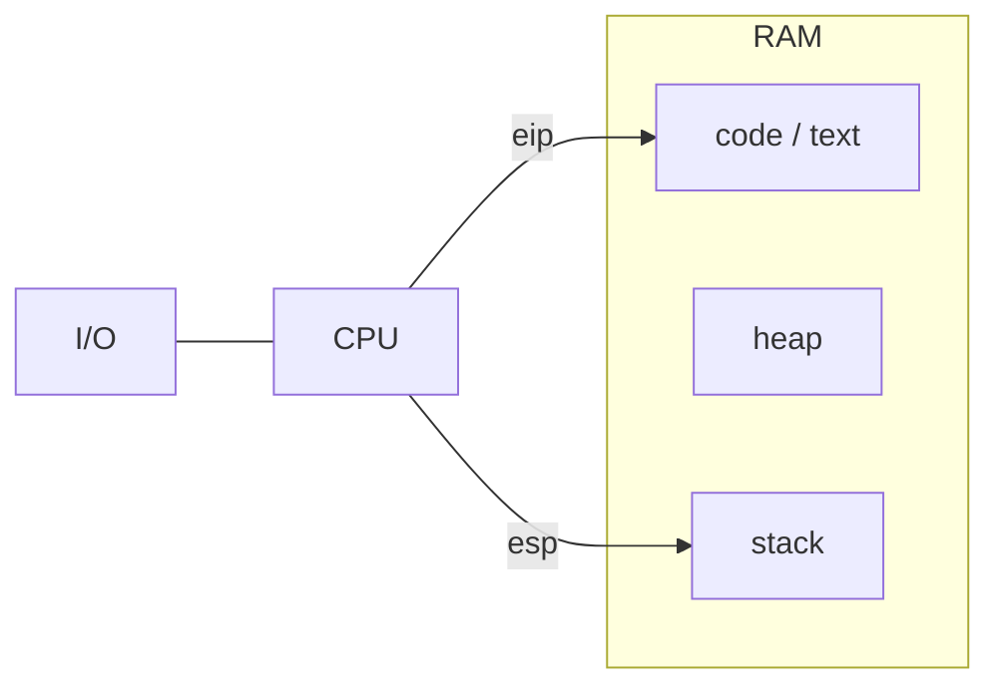
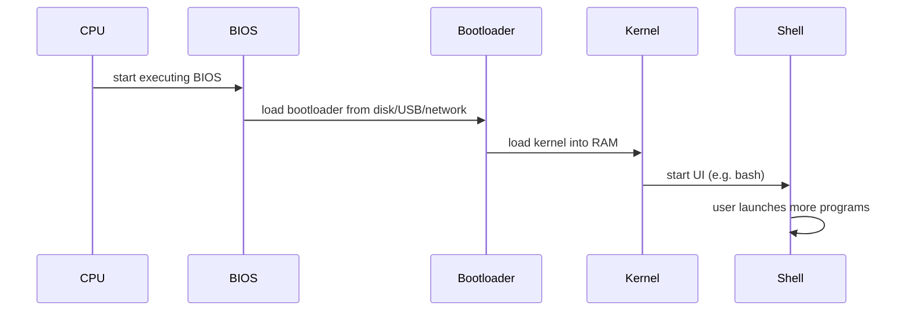
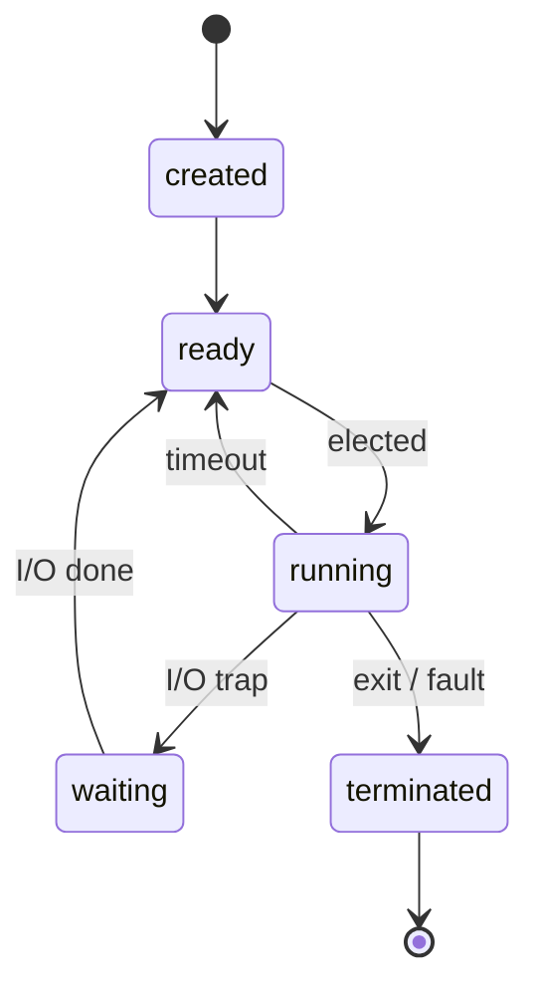
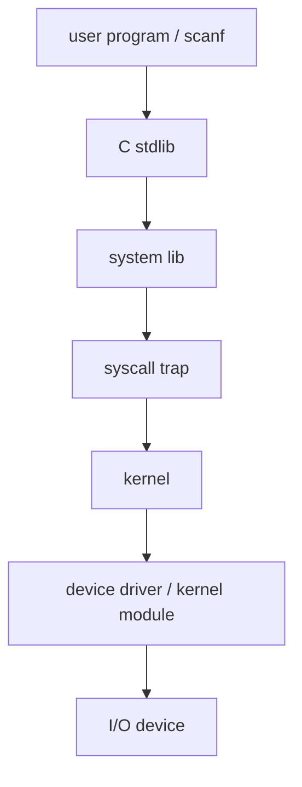
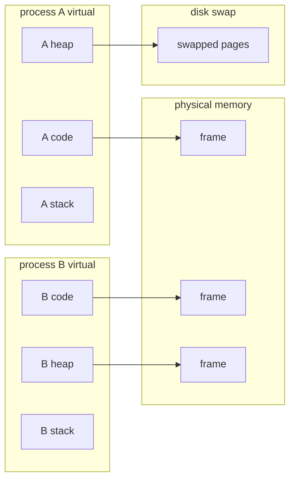

# CSCC69 Week 1 期末复习笔记｜Introduction + The Big Picture

> **课件 / Slides：** `CSCC69-Introduction.pdf`, `CSCC69-TheBigPicture.pdf`  
> **写法 / Style：** 中英对照，同一份文档。Chinese and English together in one file.

---

## 为什么学 OS / Why Study OS

OS 原则到处适用：缓存、并发、内存管理、I/O、protection。  
OS principles show up everywhere: caching, concurrency, memory management, I/O, and protection.

新硬件趋势没有改掉 1970s 的核心概念，但出现了 **multicore、能效、虚拟化**。  
New hardware did not replace 1970s concepts, but added **multicore, energy efficiency, and virtualization**.

本课是设计原则 + 亲手实现（Pintos），理论和项目绑在一起。  
This course pairs design principles with building Pintos: theory and projects stay tied together.

学 OS 能让系统软件不再神秘，也是大型复杂系统演化的样本。  
Studying OS makes system software less mysterious and shows how large systems evolve.

---

## 课程与 Pintos / Course Work and Pintos

4 个项目：Threads、User Programs、Virtual Memory、File System。  
Four projects: Threads, User Programs, Virtual Memory, File System.

运行栈：Pintos 程序 → Bochs/QEMU → Linux → Docker → 你的电脑（“turtle all the way down”）。  
The stack is Pintos → Bochs/QEMU → Linux → Docker → your machine (“turtles all the way down”).

组队不是“分工项目”：每人必须能设计并实现整套方案。先独立做，再对方案。  
A group is not a split-the-work team: everyone must design and implement the whole solution. Work alone first, then compare.

评分三块：自动化测试（过/不过，无部分分）、design document、coding style。  
Grading has three parts: automated tests (pass/fail, no partial credit), the design document, and coding style.

迟交：全组共 4 个 late days，可拆到 4 个项目。  
Each group has 4 late days to spread across the 4 projects.

协作可以讲概念和算法；不能看别人实现、不能上网抄 GitHub 答案、不能公开自己的解。  
You may discuss concepts and algorithms; you may not share implementations, copy GitHub solutions, or publish your own.

AI：不能用来生成作业代码或 design-doc 答案；可以问概念、读 starter code、要反馈。项目根目录有 `AGENTS.md`，禁止改/删。  
AI must not generate assignment code or design-doc answers. You may ask conceptual questions, read starter code, and request feedback. Do not edit or delete `AGENTS.md`.

---

## 一台简单计算机 / A Simple Computer

硬件：CPU + RAM + I/O。CPU 执行内存里的指令（ISA：算术、访存、位运算、跳转）。现代 x86-64 大约 2000 条指令。  
Hardware is CPU + RAM + I/O. The CPU executes instructions stored in memory (ISA: arithmetic, loads/stores, bit logic, jumps). Modern x86-64 has ~2000 instructions.

一个程序在内存中的布局：**code (text) + heap + stack**，CPU 用 `eip`（指令指针）和 `esp`（栈指针）跑它。  
A program in memory is **code (text) + heap + stack**. The CPU uses `eip` (instruction pointer) and `esp` (stack pointer).

---

## 启动 / Bootstrapping

上电后的链条如下。OS 不是一开始就在内存里，必须被加载。  
After power-on the chain is below. The OS is not already in RAM; it must be loaded.

1. CPU 从 **BIOS** 开始执行。  
   The CPU starts in the **BIOS**.
2. BIOS 按配置从磁盘/USB/网络加载 **bootloader**。  
   The BIOS loads the **bootloader** from a configured device.
3. Bootloader 把 **kernel** 装进 RAM。  
   The bootloader loads the **kernel** into RAM.
4. Kernel 启动用户界面（如 bash）。  
   The kernel starts a user interface (e.g. bash).
5. 用户从 shell 再启动其他程序。  
   Users then start other programs from the shell.

---

## 为什么需要并发 / Why Concurrency

程序一个接一个跑时，CPU 常在 **轮询 I/O** 上空转。  
If programs run strictly one after another, the CPU often **polls I/O** and sits idle.

**中断** 让设备完成时通知 CPU，不必傻等。  
**Interrupts** let a device notify the CPU when work is done, so the CPU need not spin.

多个程序“同时”存在：各自有 stack/heap。问题包括：某个程序一直占 CPU → **starvation**；多个程序要共存于内存 → **virtual memory**；共享设备必须 **同步**。  
Multiple programs “exist at once,” each with a stack/heap. Problems: one program hogging the CPU → **starvation**; programs coexisting in RAM → **virtual memory**; shared devices need **synchronization**.

**时钟中断** 可周期性打断当前程序，实现抢占。  
A **timer interrupt** can periodically preempt the current program.

无中断：A 做 I/O 时 CPU 空转，B 只能等 A 做完。  
No interrupts: while A waits for I/O the CPU idles, so B cannot run yet.

有中断：A 等 I/O 时切去跑 B，I/O 完成后再回来跑 A。  
With interrupts: run B while A waits for I/O, then resume A.
### 线程/进程状态 / Thread/Process States

- **ready**：可跑，在等 CPU。 / Runnable, waiting for a CPU.
- **running**：正在用 CPU。 / Currently on a CPU.
- **waiting**：等 I/O 或其他事件。 / Blocked on I/O or another event.

本学期还会系统讲：调度、同步（锁/信号量/monitor）、IPC、用户线程。  
Later weeks cover scheduling, synchronization (locks/semaphores/monitors), IPC, and user threads.

多核：多个 core 才能做到真正并行；单核并发只是交错执行。  
True parallelism needs multiple cores; on one core, concurrency is interleaving.

---

## 为什么需要用户程序抽象 / Why Abstract User Programs

用户程序不能直接操作各种键盘/网卡（PS/2、USB、蓝牙、远程……）。  
User programs must not talk to every keyboard/NIC variant (PS/2, USB, Bluetooth, remote…).

OS 把设备能力包装成 **system call**。  
The OS wraps device capability as **system calls**.

系统调用类别：进程控制、文件、设备、信息/维护、通信（IPC）、protection。  
Syscall categories: process control, files, devices, information/maintenance, communication (IPC), protection.

真实路径有多层：  
The real path has many layers:

并发的好处：系统视角 CPU 利用率更高（整体更快，单个程序不一定更快）；用户视角看起来像并行。代价是必须有调度、同步、保护。  
Benefits: better CPU utilization overall (not necessarily faster for one program); programs appear parallel to the user. Cost: scheduling, synchronization, and protection.

---

## 为什么需要虚拟内存 / Why Virtual Memory

二进制里函数地址是写死的，程序不能随便放在物理内存任意位置。  
Function addresses are baked into the binary, so a program cannot sit at a random physical address.

每个进程看到自己的 **virtual address space**；OS 维护映射表，运行时把虚地址翻译成物理地址。  
Each process sees its own **virtual address space**. The OS keeps a mapping table and translates virtual to physical addresses at runtime.

物理内存不够时，把页 **swap** 到磁盘。  
If RAM is full, pages are **swapped** to disk.

---

## 为什么需要文件系统 / Why a File System

磁盘上真实布局 ≠ 用户看到的“文件和目录树”。FS 负责命名、组织和持久化。  
On-disk layout is not the file-and-folder tree users see. The FS names, organizes, and persists data.

---

## OS 是什么（期末可背）/ What Is an OS

OS 管理硬件并运行程序，具体包括：  
An OS manages hardware and runs programs. Concretely it:

- 创建和管理进程 / creates and manages processes
- 管理内存（RAM 和 I/O 映射） / manages memory (RAM and I/O mappings)
- 管理磁盘上的文件和目录 / manages files and directories on disk
- 实施可靠性和安全保护 / enforces reliability and security
- 提供进程间通信 / enables inter-process communication
