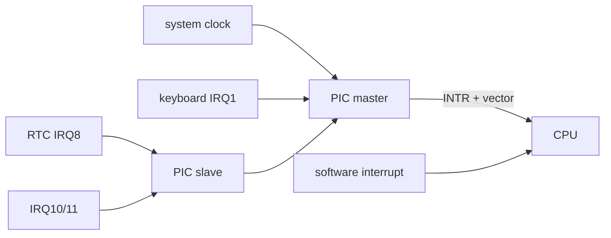
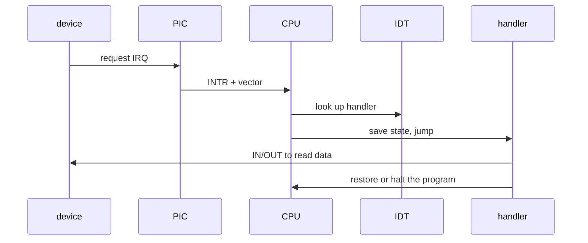
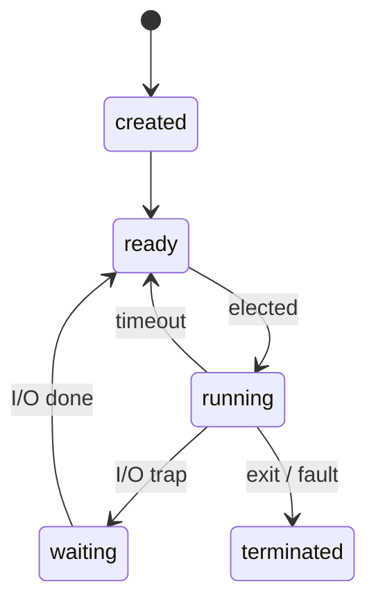
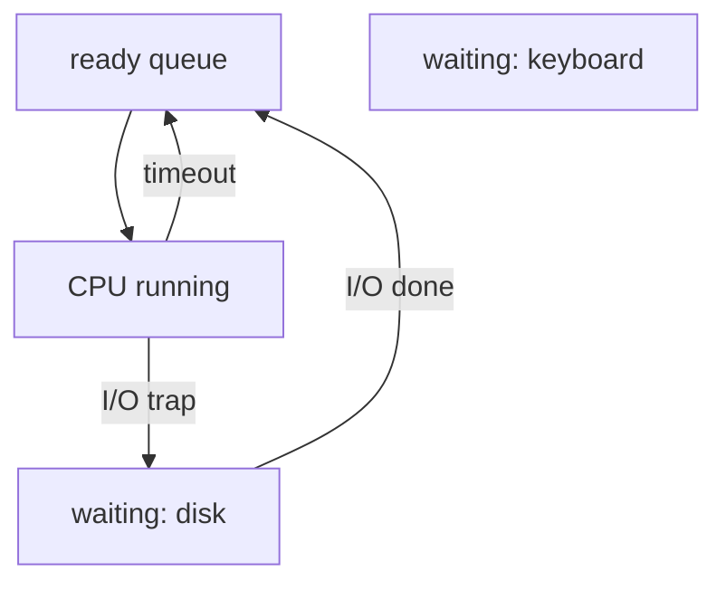
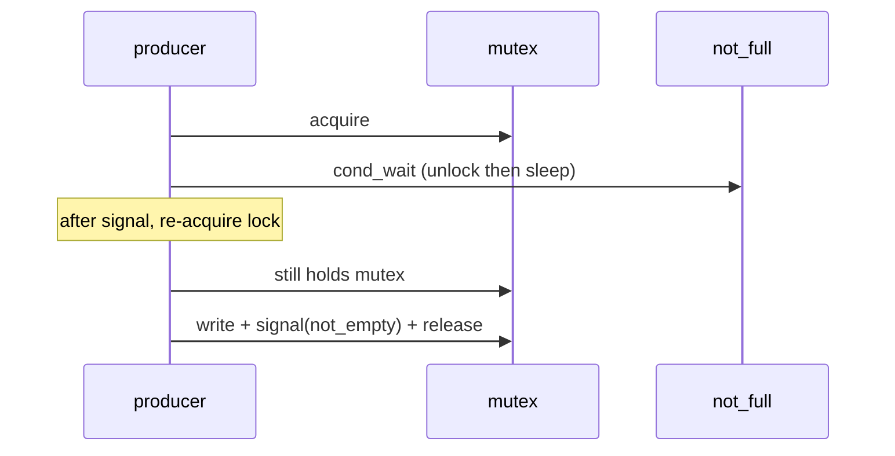
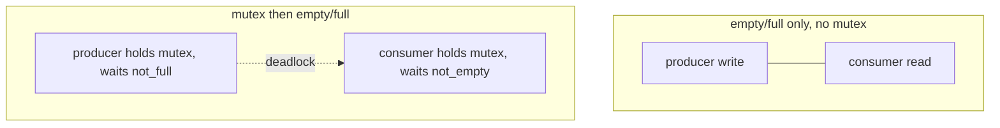
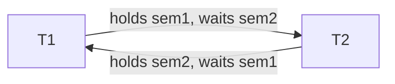
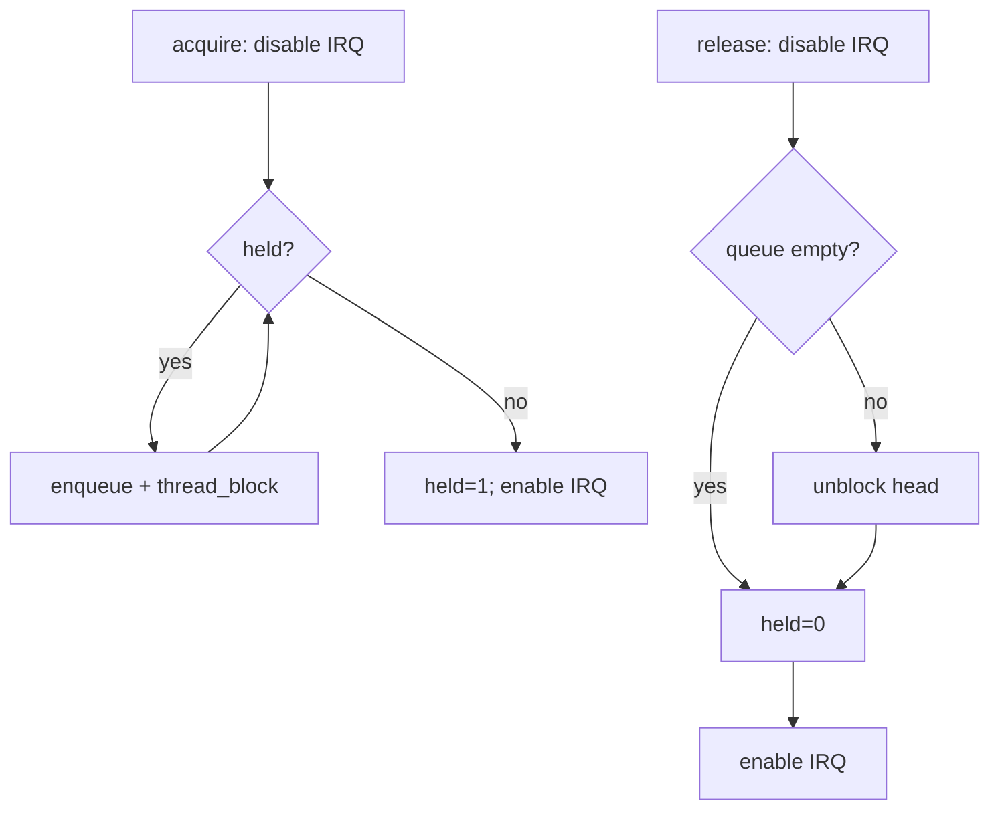
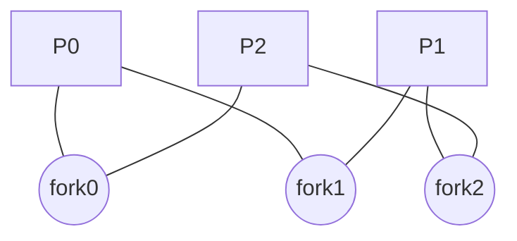

# CSCC69 Week 2 期末复习笔记｜Multithreading

> **课件 / Slides：** `CSCC69-Multithreading.pdf`  
> **写法 / Style：** 中英对照，同一份文档。

本周把 process / kernel thread / user thread 暂时看成同一类并发执行单元，聚焦 **中断、上下文切换、同步**。Pintos 现阶段没有用户进程，只有 **kernel threads**。  
This week treats process / kernel thread / user thread as the same kind of concurrent unit, and focuses on **interrupts, context switching, and synchronization**. Pintos has no user processes yet — only **kernel threads**.

---

## 程序 vs 线程 / Program vs Thread

**Program**：磁盘上的静态代码和数据。  
A **program** is static code and data on storage.

**Thread**：一次正在执行的实例。同一程序可有多个线程并发跑。  
A **thread** is a running instance. Different threads of the same program can run concurrently.

并发靠 **Limited Direct Execution**：线程直接在 CPU 上跑一小段，再切换。切换触发：线程主动让出（如非阻塞 I/O），或时钟中断抢占。  
Concurrency uses **Limited Direct Execution**: a thread runs directly on the CPU for a while, then switches. A switch happens when the thread yields (e.g. non-blocking I/O) or a timer interrupt preempts it.

系统视角：整体吞吐更高（单个不一定更快）；用户视角：看起来像并行。  
System view: better overall throughput (not necessarily faster for one thread). User view: programs appear parallel.

---

## 1. 中断 / Interrupts

### 两类中断 / Two Kinds of Interrupts

| 类型 Type | 别名 Alias | 来源 Source | 同步性 | 例子 Examples |
| --- | --- | --- | --- | --- |
| External | hardware interrupt | I/O 设备 / I/O device | 异步 async | 键盘、时钟、磁盘完成 / keyboard, timer, disk done |
| Internal | syscall / exception / fault | 正在执行的指令 / executing instruction | 同步 sync | 除零、page fault、`int` |

Internal 再分：  
Internal interrupts further split into:

- **Fault**：如除零、page fault。 / e.g. divide-by-zero, page fault.
- **Trap**：程序员故意的 `int`。Linux syscall 常用 `int $0x80`，Pintos 是 `int $0x30`。  
  **Trap:** an intentional `int`. Linux syscalls often use `int $0x80`; Pintos uses `int $0x30`.

### PIC（Programmable Interrupt Controller）

把设备硬接到 CPU 的 IRQ 不灵活：无法屏蔽、无法设优先级。真实做法：设备接 master/slave **PIC**，PIC 再通知 CPU 的 INTR。  
Hard-wiring devices to CPU IRQ lines is inflexible (no mask, no priority). In reality, devices go through master/slave **PICs**, which notify the CPU on INTR.



16 条 IRQ（IRQ0–IRQ15），有优先级，可 mask。向量号索引 **IDT（Interrupt Descriptor Table）**，最多 256 项。  
There are 16 IRQ lines (IRQ0–IRQ15), with priority and masking. The vector indexes the **IDT**, with up to 256 entries.

### 处理流程 / Handling an Interrupt



键盘例子：按键 → 键盘控制器让 PIC 在 IRQ1 上中断 → PIC 决定是否通知 CPU → 向量号索引 IDT → handler 用 IN/OUT 读键值 → 恢复原程序。  
Keyboard example: keypress → controller asks PIC for IRQ1 → PIC may notify the CPU → vector indexes the IDT → handler uses IN/OUT to read the key → restore the old program.

Pintos 看 `src/threads/interrupt.c`。Linux：`cat /proc/interrupts`。

---

## 2. 上下文切换 / Context Switching

单核上同一时刻只有一个 thread **running**；其他在 **ready** 或 **waiting**。  
On one core, only one thread is **running**; others are **ready** or **waiting**.



### 何时切换 / When to Switch

| 事件 Event | OS 做什么 / What the OS does |
| --- | --- |
| Fault | 挂起，常直接终止该线程 / suspend, often terminate |
| 时钟中断 / timer | 保存上下文 → 标 ready → 选下一个 → 恢复 / save, mark ready, elect, restore |
| syscall trap（I/O） | 保存上下文 → 标 waiting → 选下一个 / save, mark waiting, elect next |
| 其他 I/O 中断 / other I/O IRQ | 做完 I/O，把等待者标 ready，**通常继续当前线程** / finish I/O, mark waiter ready, **usually resume current** |

OS 必须记住每个线程的 **状态 + 执行上下文（寄存器、栈、堆等）**。  
The OS must remember each thread’s **state + execution context** (registers, stack, heap, …).

### TCB 与队列 / TCB and Queues

**TCB（Thread Control Block）** 典型字段：tid、state、寄存器（含 eip/esp）、指向 PCB 的指针、user 信息。  
A **TCB** typically stores tid, state, registers (including eip/esp), a pointer to the PCB, and user info.



一个 **ready queue**，多种 **waiting queue**（按 I/O 类型）。  
One ready queue; multiple waiting queues (one per I/O type).

---

## 3. 同步 / Synchronization

### 竞态 / Race Condition

共享变量 `x++` / `x--` 在 CPU 上不是原子的（LOAD / INCR / STORE）。交错后结果可以是 0、-1 或 1。Too Much Milk 是生活版竞态。  
`x++` / `x--` is not atomic (LOAD / INCR / STORE). Interleaving can leave x as 0, -1, or 1. “Too Much Milk” is the everyday version.

```mermaid
sequenceDiagram
  participant T1
  participant Mem as x
  participant T2
  Note over T1,T2: both LOAD 0; final x is 1 or -1
  T1->>Mem: LOAD x=0
  T2->>Mem: LOAD x=0
  T1->>Mem: STORE 1
  T2->>Mem: STORE -1
```

**Critical section**：用互斥保护的代码段。同时只能有一个线程进入。  
A **critical section** is code protected by mutual exclusion. Only one thread may execute it at a time.

### 临界区四个要求 / Four Requirements

1. **Mutual exclusion（安全 / safety）**：一人在内，别人不能进。  
   If one thread is in the CS, no other is.
2. **Progress**：不在临界区的线程不能永远挡住别人进去；进去的人最终会出来。  
   A thread not in the CS cannot forever block others; a thread in the CS eventually leaves.
3. **Bounded waiting（活性 / liveness，无饥饿）**：等待者最终能进。  
   A waiting thread eventually enters.
4. **Performance**：进出开销相对临界区工作要小。  
   Enter/exit overhead should be small vs work inside.

Progress + bounded waiting 保证活性（something good happens）；mutual exclusion 保证安全（nothing bad happens）。  
Progress + bounded waiting give liveness; mutual exclusion gives safety.

### Lock / Mutex

- `init()`：创建未锁互斥量 / create an unlocked mutex
- `acquire()`：等到未锁，然后锁上进入 CS / wait until unlocked, then lock and enter
- `release()`：解锁并唤醒等待者 / unlock and wake a waiter

只锁 buffer 读写不够：生产者可能写入已满 buffer。正确写法之一：持锁检查，满了就 `release + yield + acquire` 再检查。更好的是条件变量。  
A lock around buffer I/O is not enough: a producer may write into a full buffer. One fix: while full, `release + yield + acquire` and check again. Condition variables are better.

### Condition Variable

必须与 lock 一起用。  
Must be used with a lock.

- `cond_wait(cond, lock)`：**先解锁再睡**，被唤醒后 **重新抢锁** 才返回。  
  **Drop the lock and sleep**; after a signal, **re-acquire the lock** before returning.
- `cond_signal(cond)`：唤醒一个等待者。 / Wake one waiter.
- `cond_broadcast(cond)`：唤醒全部。 / Wake all.

课件里的 `if (full) cond_wait` 是简化版；实际应写成 `while`，防止虚假唤醒和 signal 丢失后的状态变化。  
The slide’s `if (full) cond_wait` is simplified. Real code should use `while` against spurious wakeups and state changes after a lost signal.



### Semaphore（Dijkstra）

整数 + 等待队列。  
An integer plus a wait queue.

- `P()` / `wait` / `sem_down`：值减 1，不够就阻塞。 / Decrement; block if not open.
- `V()` / `signal` / `sem_up`：值加 1；若有等待者则唤醒。**信号会被记住**（值可以先涨）。  
  Increment; wake a waiter if any. **The signal is remembered** (the value can rise first).
- 不变量：semaphore 值 **≥ 0**。 / Invariant: value is always **≥ 0**.

生产者-消费者正确顺序 / Correct producer–consumer order:

```
producer:  wait(not_full) → wait(mutex) → write → signal(mutex) → signal(not_empty)
consumer:  wait(not_empty) → wait(mutex) → read  → signal(mutex) → signal(not_full)
```

先拿 mutex 再等 not_full/not_empty → **死锁**。只用 empty/full 不用 mutex → 两人可同时进临界区。  
Taking mutex before empty/full → **deadlock**. Using only empty/full without mutex → producer and consumer can be in the CS together.



### 死锁 / Deadlock

两个线程以相反顺序拿两把锁/信号量，互相等待。  
Two threads each hold a resource the other waits for.



避免很难，见 OSTEP Ch.32。  
Avoiding deadlock with primitive locks/semaphores is hard (OSTEP Ch.32).

### 实现：先锁还是先信号量 / Implementation Order

Linux：先实现 lock，再做 semaphore / CV。Linux 有 **spinlock（忙等）** 和 **mutex（阻塞）**。  
Linux implements locks first, then semaphores/CVs. Linux has **spinlocks** (busy-wait) and **mutexes** (blocking).

Pintos：先实现 **semaphore**，再在上面做 lock 和 CV。  
Pintos implements **semaphores** first, then builds locks and CVs on top.

### Spinlock

坏实现：`while (held); held = 1;` —— 检查和置位之间可被切换，有竞态。  
Bad: `while (held); held = 1;` — a context switch between the check and the set is a race.

硬件 **test-and-set**：原子地写成 1 并返回旧值。好的 spinlock：`while test-and-set(&held);`  
Hardware **test-and-set** writes 1 and returns the old value atomically. Good spinlock: `while test-and-set(&held);`

缺点：浪费 CPU、不公平。  
Downsides: wastes CPU; unfair.

### Sleeping lock

只关中断当锁：会错过/延迟外部事件，线程不再可抢占。不好。  
Using only `disable_interrupts` as a lock misses/delays events and makes the thread non-preemptive. Bad.

好的 sleeping lock：关中断 + 等待队列。拿不到锁就 `enqueue + thread_block`；release 时 `thread_unblock` 队头。临界区前后 disable/enable interrupts，避免丢失唤醒。  
A good sleeping lock: disable interrupts + a wait queue. If the lock is held, `enqueue + thread_block`; on release, `thread_unblock` the head. Disable/enable around the CS so wakeups are not lost.

Semaphore 实现同理：`value==0` 就入队阻塞；`V` 时若有等待者则唤醒，并维护 `value`。  
Semaphores are similar: block when `value==0`; `V` unblocks a waiter and updates `value`.



---

## 经典问题 / Classic Problems

### Readers–Writers

允许多个 reader，writer 独占。  
Many readers, but a writer is exclusive.

基本解：`readcount` + `mutex`（保护 readcount）+ `writer_or_readers`（写者与“第一/最后一个读者”互斥）。第一个读者 `wait(writer_or_readers)`，最后一个读者 `signal`。问题：**写者饥饿**。  
Basic solution: `readcount` + `mutex` (protects the count) + `writer_or_readers` (exclusive to a writer or to “first/last reader”). The first reader waits; the last reader signals. Problem: **writer starvation**.

加 `service` 信号量排队后，读者写者公平进入，可缓解饥饿。  
A `service` semaphore that queues arrivals lets readers and writers enter fairly and reduces starvation.

### Dining Philosophers

每人先拿左叉再拿右叉 → 可能同时拿起第一把 → 死锁。  
Everyone grabs the left fork then the right → all may hold the first fork → deadlock.

解法之一：最后一个人 **反过来拿**，打破环形等待。  
One fix: the last philosopher grabs forks in **reverse order**, breaking the wait cycle.



---

## 考试速记 / Exam Cheat Sheet

- 中断：外部异步 vs 内部同步；PIC + IDT。  
  Interrupts: external/async vs internal/sync; PIC + IDT.
- 切换：保存 TCB；普通 I/O 完成通常不立刻抢当前线程。  
  Switching saves the TCB; a normal I/O completion usually does not immediately preempt the current thread.
- 原子性靠硬件 TAS 或关中断（仅内核、短临界区）。  
  Atomicity: hardware TAS, or disable interrupts (kernel, short CS only).
- CV 的 wait 会放锁；semaphore 的 V 会记住信号。  
  CV wait drops the lock; semaphore V remembers the signal.
- 生产者消费者：锁保护数据，额外同步保护空/满；先 mutex 再 empty/full 会死锁。  
  Producer–consumer: a lock protects the data; extra sync protects empty/full. Mutex-then-empty/full deadlocks.
- Readers–Writers 基本解会饿死写者；哲学家靠打破环避免死锁。  
  Basic readers–writers starves writers; dining philosophers needs a break in the cycle.
