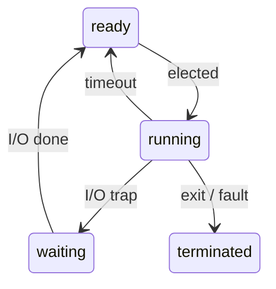
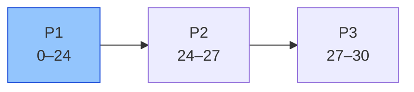
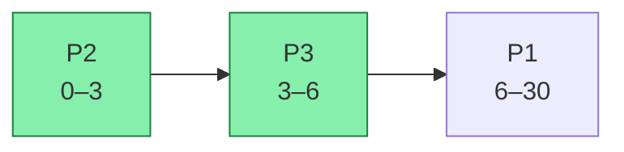
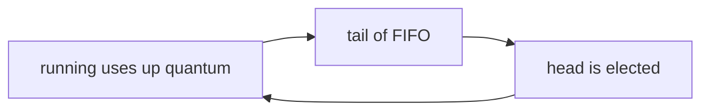
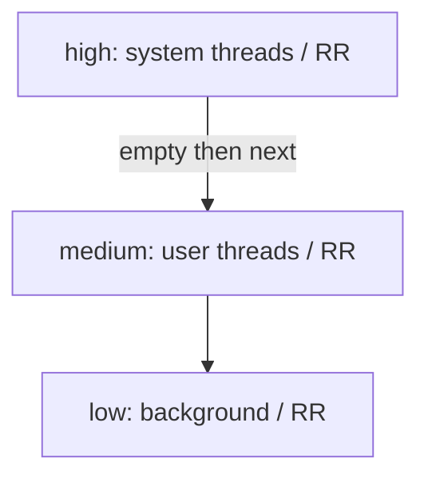
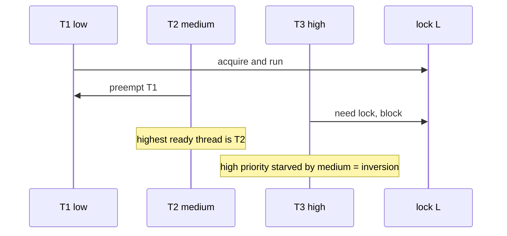
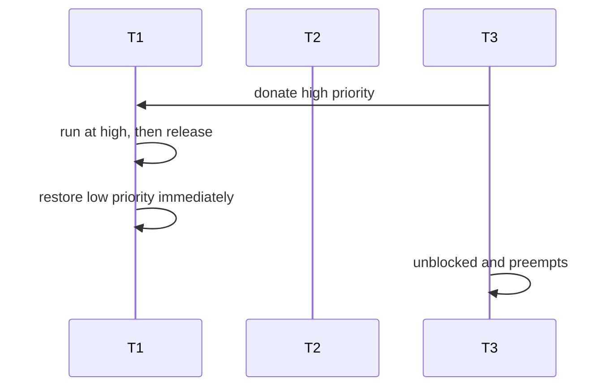
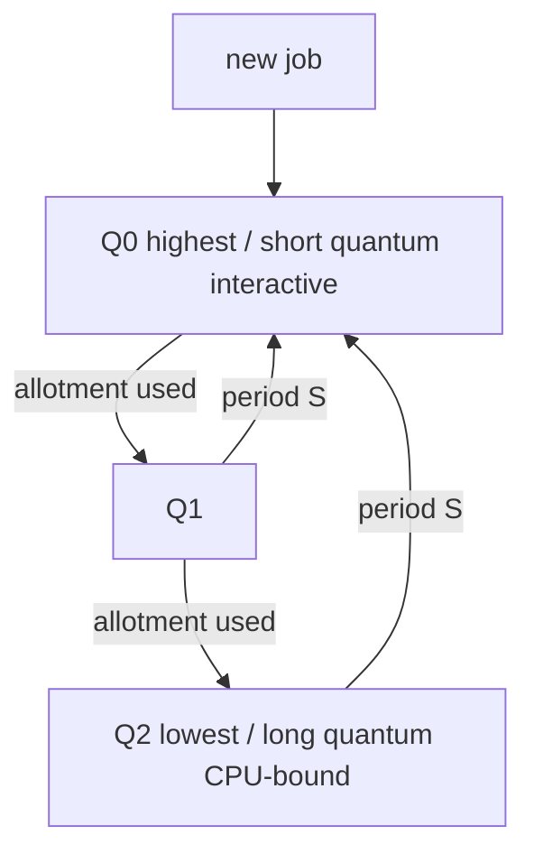

# CSCC69 Week 3 期末复习笔记｜Scheduling

> **课件 / Slides：** `CSCC69-Scheduling.pdf`  
> **写法 / Style：** 中英对照，同一份文档。

---

## 问题定义 / The Scheduling Problem

有 n 个 ready 线程、k ≥ 1 个 CPU。调度策略决定：**把哪个 job 分给哪个 CPU，跑多久**。  
There are n ready threads and k ≥ 1 CPUs. A scheduling policy decides **which jobs get which CPU(s), and for how long**.

调度发生在 ready ⇄ running：  
Scheduling happens on ready ⇄ running:

---

## Starvation（非目标）/ Starvation (Not a Goal)

线程因为别人占着它需要的资源（CPU 或锁）而永远无法前进。  
A thread cannot make progress because another thread holds the resource it needs (CPU or a lock).

调度引起：高优先级一直压着低优先级。  
From scheduling: a high-priority thread forever keeps a low-priority one off the CPU.

同步引起：源源不断的 readers 挡住 writers。  
From synchronization: a constant stream of readers blocks writers.

---

## 评价指标 / Scheduling Criteria

| 指标 Metric | 含义 Meaning | 方向 Better |
| --- | --- | --- |
| Throughput | 单位时间完成的线程数 / jobs per unit time | 越高 / higher |
| Turnaround time | \(T_{finish} - T_{start}\) | 越低 / lower |
| Response time | waiting→ready 再到 ready→running | 越低 / lower |
| CPU utilization | CPU 做有用功的比例 / productive CPU fraction | 越高 / higher |
| Waiting time | ready 队列平均等待 / avg time in ready queue | 越低 / lower |

批处理系统看吞吐和周转；交互系统看响应。用户更喜欢 **可预测** 的响应，而不是偶尔很快但抖动很大。常优化平均响应时间。  
Batch systems care about throughput and turnaround. Interactive systems care about response time. Users prefer **predictable** response over faster but highly variable response. We often optimize average response time.

---

## 抢占 vs 非抢占 / Preemptive vs Non-preemptive

**Non-preemptive**：分到 CPU 就一直跑到结束。适合批处理。  
Once a thread has the CPU, it keeps it until it terminates. Good for batch.

**Preemptive**：可以中途抢走 CPU。适合交互。  
The CPU can be taken from a running thread. Good for interactive systems.

---

## 算法 / Algorithms

课件同一组例子：三个作业在 t=0 到达，burst = 24, 3, 3。  
The slides use the same example: three jobs arrive at t=0 with bursts 24, 3, 3.

### FCFS（First Come First Serve，非抢占 / non-preemptive）

按到达顺序跑，不打断。顺序 P1→P2→P3：  
Run jobs in arrival order, no interrupt. Order P1→P2→P3:

- Throughput：\(3/30 = 0.1\) jobs/s
- 平均周转 / avg turnaround：\((24+27+30)/3 = 27\) s
- 平均等待 / avg waiting：\((0+24+27)/3 = 17\) s

问题：**convoy effect**——一个很长的作业挡住后面所有短作业。  
Problem: the **convoy effect** — one long job blocks all short jobs behind it.

### SJF（Shortest-Job-First，非抢占 / non-preemptive）

每次选预计 CPU burst 最短的。  
Always pick the shortest remaining processing time.

- Throughput 仍 0.1 / still 0.1
- 平均周转 / avg turnaround：\((30+3+6)/3 = 13\) s
- 平均等待 / avg waiting：\((0+3+6)/3 = 3\) s

问题：必须事先知道运行时间。  
Problem: you must know processing time in advance.

### SRTF（Shortest-Remaining-Time-First，抢占版 SJF / preemptive SJF）

新作业剩余时间更短就抢占。等待时间好，但可能 **饥饿** 长作业。  
If a new job’s burst is shorter than the current remaining time, preempt. Waiting time is good, but long jobs can **starve**.

### RR（Round Robin，抢占 / preemptive）

每个作业一个 **quantum**，用完排到 FIFO 队尾。  
Each job gets a **quantum**, then goes to the back of a FIFO queue.

优点：公平、交互响应好。问题：没有优先级。  
Good: fair, low waiting for interactive jobs. Bad: no priorities.

Quantum 选择：必须远大于上下文切换代价；多数 burst 应小于 quantum，否则退化成 FCFS。典型 **1–100 ms**。  
Pick a quantum much larger than context-switch cost; most bursts should finish within a quantum, or the system reverts to FCFS. Typical **1–100 ms**.

---

## 为什么要有优先级 / Why Priorities

批处理作业要优化周转；交互作业要最小化响应。于是引入多级队列。  
Batch jobs want turnaround; interactive jobs want response. Hence multilevel queues.

### MLQ（Multilevel Queue）

线程有固定优先级；高优先先跑，同优先级 RR。  
Each thread has a fixed priority. Highest priority runs; same priority uses RR.

三个问题 / Three problems:

1. 低优先级饥饿。 / Low-priority starvation.
2. **高优先级也可能饥饿（priority inversion）**。 / **High-priority starvation too (priority inversion).**
3. 优先级怎么定。 / How to assign priorities.

### Priority inversion 与 priority donation（Pintos 重点）

**Priority donation**：T3 把高优先级捐给持锁的 T1。T1 以高优先级跑完、放锁、立刻恢复原优先级；T3 被唤醒后抢占运行。  
**Priority donation:** T3 donates its high priority to lock-holder T1. T1 runs at high priority, releases the lock, and immediately returns to low priority; T3 wakes and preempts.

Pintos Project 1 还要求嵌套捐赠、多把锁、链状捐赠。考试可能画 3 个线程 + 1 把锁，问谁在跑、优先级变成多少。  
Pintos Project 1 also requires nested donation, multiple locks, and donation chains. An exam may draw 3 threads + 1 lock and ask who runs and what priorities become.

### 缓解 MLQ 其他问题 / Other MLQ Fixes

低优先级饥饿：等待越久优先级升高，或 CPU 用得越多优先级下降。  
To avoid low-priority starvation: raise priority with waiting time, or lower it with CPU consumption.

如何定优先级：观察线程的 CPU 使用情况。  
To pick priorities: observe CPU usage.

### MLFQ（Multilevel Feedback Queue）

MLQ + **根据观察改优先级**（Turing Award 算法）。  
MLQ plus **priority changes from observation** (Turing-award algorithm).

规则 / Rules:

1. Priority(A) > Priority(B) → A 跑。 / A runs.
2. 同优先级 → 用该队列的 time slice 做 RR。 / Same priority: RR with that queue’s slice.
3. 新作业进 **最高** 队列。 / A new job starts at the **highest** queue.
4. 在某层用尽时间配额（不管中间让出过几次 CPU）→ 降一层。  
   Once a job uses up its allotment at a level (regardless of how many times it yielded), it drops one queue.
5. 每隔周期 S，**所有作业升回最高层**（防止饥饿、适应行为变化）。  
   Every period S, **move all jobs to the top queue** (prevents starvation; adapts to changing behavior).

交互作业（常让出 CPU）会留在高层；CPU-bound 会降到低层跑长量子。  
Interactive jobs (that often yield) stay high; CPU-bound jobs sink to long-quantum low queues.

---

## 考试速记 / Exam Cheat Sheet

- 会算 FCFS/SJF 的平均周转、等待；能指出 convoy。  
  Compute FCFS/SJF turnaround and waiting; name the convoy effect.
- SRTF vs SJF：抢占 + 可能饥饿。  
  SRTF vs SJF: preemption + possible starvation.
- RR 的 quantum 过大/过小各有什么问题。  
  RR quantum too large ≈ FCFS; too small ≈ huge switch cost.
- 会画 priority inversion，并写出 donation 后的优先级变化。  
  Draw inversion and the priorities after donation.
- 能默写 MLFQ 五条规则，尤其是规则 4（累计配额）和规则 5（周期性提升）。  
  Recite MLFQ’s five rules, especially rule 4 (cumulative allotment) and rule 5 (periodic boost).
