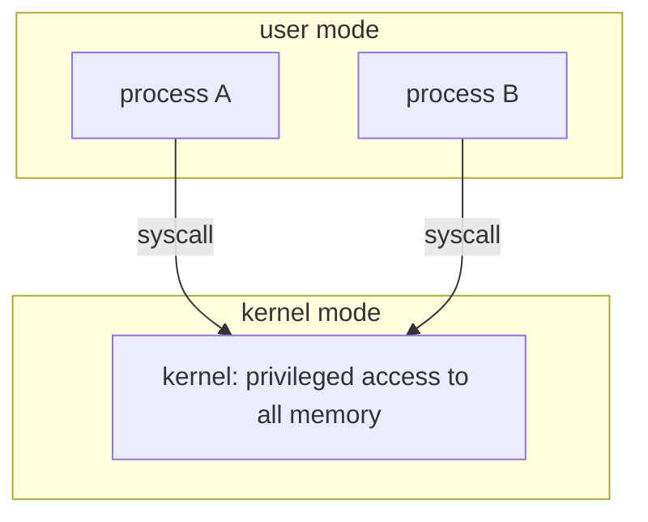
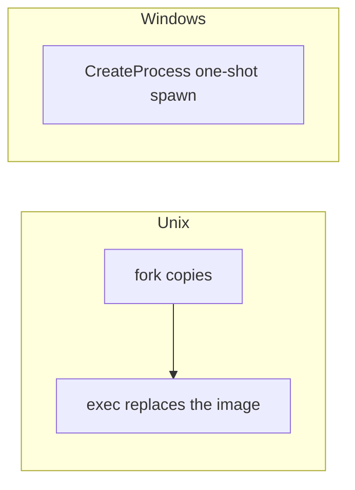
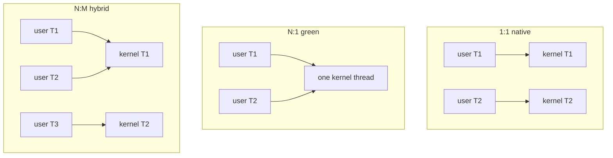

# CSCC69 Week 4 期末复习笔记｜User Programs

> **课件 / Slides：** `CSCC69-UserPrograms.pdf`  
> **写法 / Style：** 中英对照，同一份文档。

---

## 为什么要保护 / Why Protection

用户程序如果和内核、其他程序共用裸物理内存：程序之间会互相踩内存；用户程序可能破坏 kernel；共享资源必须经过内核。  
If user programs share raw physical memory with the kernel and each other: they can corrupt each other, they can smash the kernel, and shared resources must go through the kernel.

三条原则 / Three principles:



1. 用户程序作为 **process** 彼此隔离（user mode）。  
   User programs run as **processes** isolated from each other (user mode).
2. 内核有特权，可访问全部内存（kernel mode）。  
   The kernel has privileged access to all memory (kernel mode).
3. 进程只能通过 **system call** 使用资源。  
   Processes access resources only through **system calls**.

真正隔离靠后面的 **Virtual Memory**：用户只碰虚地址，内核管映射。  
True isolation comes from **virtual memory**: user code uses virtual addresses; the kernel owns the mappings.

---

## 系统调用 / System Calls

用户不直接操作设备。Syscall 是 OS 提供给用户程序的 API。类别：进程控制、文件、设备、信息/维护、IPC、protection。Linux 3.7 约 393 个。  
User programs do not operate devices directly. Syscalls are the OS API. Categories: process control, files, devices, information/maintenance, IPC, protection. Linux 3.7 has about 393.

调用栈：用户代码 → C 库（如 `scanf`）→ 系统库包装 → trap 进内核 → driver。  
Call stack: user code → C library (`scanf`) → system lib wrapper → trap into the kernel → driver.

### 如何陷入内核 / How to Invoke a Syscall

用户不能直接跳进内核地址。用 **software interrupt（syscall trap）**。  
User code cannot jump into kernel addresses. It uses a **software interrupt (syscall trap)**.

```mermaid
sequenceDiagram
  participant P as user program
  participant Lib as libc write()
  participant CPU
  participant H as int 0x80 handler
  participant K as kernel write
  P->>Lib: write("hello")
  Lib->>CPU: push syscall number and args; int 0x80
  CPU->>H: enter kernel mode
  H->>H: read syscall number and args from user stack
  H->>K: dispatch
  K-->>P: return value in a register
```

1. 程序调用库函数，如 `write("hello")`。 / The program calls a library function.
2. 库把 syscall 号和参数压栈，执行 `int 0x80`。 / The library pushes the number and args, then traps.
3. 中断处理程序从被中断进程的栈读出 syscall 号和参数。 / The handler reads them from the interrupted stack.
4. 分派到内核里对应的 syscall 实现。 / Dispatch to the kernel implementation.
5. 通过寄存器返回值。 / Return a value in a register.

Pintos Project 2 就是把这套做出来：验证用户指针、分派 syscall。Pintos trap 是 `int $0x30`。  
Pintos Project 2 is this path: validate user pointers and dispatch syscalls. Pintos traps with `int $0x30`.

---

## 进程 / Processes

从程序员看：创建/终止、通信、查询信息、暂停/继续。  
From the programmer: create/terminate, communicate, query, stop/resume.

### PCB（Process Control Block）

pid、ppid、（可选）user、address space、打开的文件、其他内核资源。线程的 TCB 会指向 PCB。  
pid, ppid, optional user, address space, open files, other kernel resources. A thread TCB points at the PCB.

进程由另一个进程创建（父子关系）。内核启动时创建根进程（简单 OS 是 shell，GUI OS 是 Window Manager）。  
A process is created by another process (parent/child). The kernel creates the root parent at boot (a shell, or a window manager).

### Unix：fork

`int fork()`：

1. 新建并初始化 PCB。 / Create and initialize a new PCB.
2. 新建地址空间。 / Create a new address space.
3. **拷贝** 父进程地址空间（后面用 CoW 优化；有一处例外）。 / **Copy** the parent’s address space (later optimized with CoW; one exception).
4. 继承内核资源（如打开的文件）。 / Point kernel resources at the parent’s (e.g. open files).
5. 创建与该进程关联的内核线程，放入 ready 队列。 / Create a kernel thread and place it on the ready queue.

父子都从 fork 返回：父得 child pid，子得 0。适合子进程要基于父数据协作（如 web server fork 每个请求）。  
Both return from fork: parent gets the child pid, child gets 0. Useful when the child cooperates using the parent’s data (e.g. a web server forking per request).

### Unix：exec

`exec(prog, argv)` **不创建新进程**，只是：  
`exec` **does not create a new process**. It:

1. 停掉当前进程。 / Stops the current process.
2. 把 `prog` 装进现有地址空间。 / Loads `prog` into this address space.
3. 初始化硬件上下文和参数。 / Initializes hardware context and args.
4. PCB 回到 ready 队列。 / Places the PCB on the ready queue.

多数 `fork` 后面立刻 `exec`，合称 **spawn**。课件例子：`minish.sh`、`redirsh.c`、`pipesh.c`。  
Most `fork`s are followed by `exec` (**spawn**). Slide examples: `minish.sh`, `redirsh.c`, `pipesh.c`.

论文 *A fork() in the road* 的核心批评之一是安全（地址空间被完整复制）。  
*A fork() in the road* argues mainly from security (the address space is copied wholesale).

### Windows：CreateProcess

一步完成：新 PCB + 新地址空间 + 加载指定程序 + 拷贝参数 + 从 main 开始 + 放入 ready。没有 Unix 那种“先复制再替换”。  
One shot: new PCB + new address space + load the program + copy args + start at main + ready queue. No “copy then replace”.



### wait / exit

Unix：`wait`；Windows：`WaitForSingleObject`。  
Unix `wait`; Windows `WaitForSingleObject`.

终止：`exit` / `ExitProcess`。OS 清理：结束所有线程、关文件和网络、释放内存和换出页、从内核结构删 PCB。  
Terminate with `exit` / `ExitProcess`. The OS cleans up: all threads, files, network, memory and swapped pages, then removes the PCB.

---

## 用户线程 / User Threads

### 为什么不完全用多进程 / Why Not Only Processes

Web server 每个请求 `fork` 一次太贵：新建 PCB、拷贝地址空间和资源；进程切换要换页表；和父进程通信要用信号/管道。  
Forking a child per web request is expensive: new PCB, copy of the address space, page-table switch, and IPC via signals/pipes.

进程隔离好，但创建、切换、IPC 都贵。  
Processes isolate well, but create/switch/IPC are costly.

### 进程 vs 线程 / Process vs Thread

**Thread**：进程内的一条执行流（PC、SP、寄存器）。  
A **thread** is a sequential execution stream (PC, SP, registers).

**Process**：地址空间和除执行流以外的属性。  
A **process** is the address space and everything except the execution streams.

线程绑定在一个进程上；一个进程可以有多个线程。  
A thread is bound to one process; a process can have many threads.

好处：响应性（后台等事件时前台继续）、共享内存协作、更省时间/空间、多核可扩展。  
Benefits: responsiveness, sharing memory, cheaper time/space, multicore scalability.

### 三种名字不要混 / Do Not Mix These Names

| 概念 Term | 空间 Space | 角色 Role |
| --- | --- | --- |
| Process | 用户+内核 / user+kernel | 程序的运行实例，隔离单位 / running instance, isolation unit |
| User thread | User space | 进程内用户定义的并发 / user-defined concurrency |
| Kernel thread | Kernel space | **真正的调度单位** / **the unit of scheduling** |

### 多线程模型 / Multithreading Models



**One-to-one（kernel-level / native）**  
每个用户线程对应一个内核线程。例子：Windows threads、POSIX `PTHREAD_SCOPE_SYSTEM`、Solaris LWP。调度好，能用多核；线程操作都进内核，相对慢。  
Each user thread maps to one kernel thread. Examples: Windows threads, POSIX `PTHREAD_SCOPE_SYSTEM`, Solaris LWP. Good for scheduling and multicore; operations go through the kernel, so slower.

**Many-to-one（user-level / green threads）**  
每进程一个内核线程，用户库自己调度。例子：`PTHREAD_SCOPE_PROCESS`、早期 Java threads。非常轻；**一个线程阻塞，全进程可能堵**；不能真正多核并行。  
One kernel thread per process; a library schedules. Examples: `PTHREAD_SCOPE_PROCESS`, early Java threads. Very light; **one blocking thread can stall the whole process**; cannot use multiple cores.

**Many-to-many（hybrid / n:m）**  
多个用户线程映射到多个内核线程。例子：旧 Solaris。  
Many user threads on many kernel threads. Example: old Solaris.

### POSIX 线程 API（概念）/ POSIX Thread API (Idea)

- `thread_create(fn, arg)`：分配 TCB 和栈，把 fn/args 放好，加入 ready。 / Allocate TCB and stack, put fn/args on the stack, enqueue.
- `thread_exit()`：销毁当前线程。 / Destroy the current thread.
- `thread_join(tid)`：等它结束。 / Wait for it to exit.

---

## 考试速记 / Exam Cheat Sheet

- 用户态不能直接碰设备和内核内存；靠 trap。  
  User mode cannot touch devices or kernel memory; it traps.
- 能按步骤写出 syscall 从库函数到内核的路径。  
  Write the syscall path from library to kernel.
- fork 复制进程，exec 替换映像；CreateProcess 一步 spawn。  
  fork copies a process; exec replaces the image; CreateProcess is one-shot spawn.
- 线程共享地址空间，进程不共享。  
  Threads share an address space; processes do not.
- 1:1 vs N:1：阻塞和多核行为完全不同。  
  1:1 vs N:1 differ on blocking and multicore.
