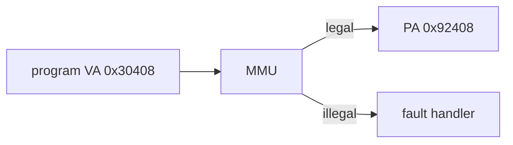
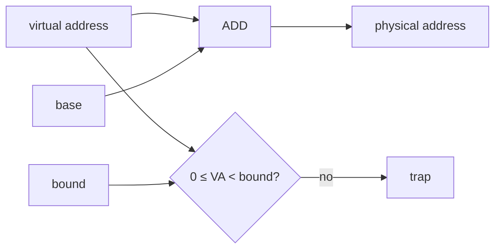
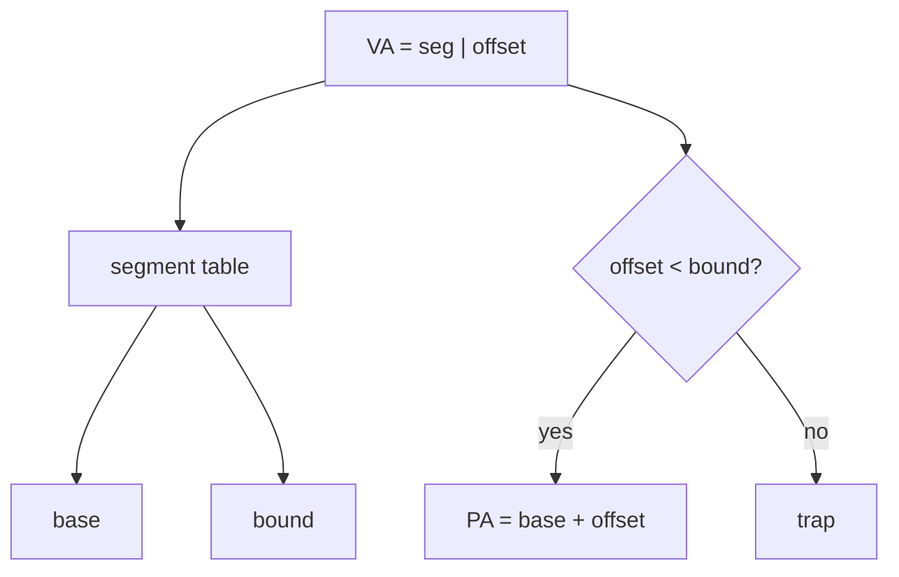
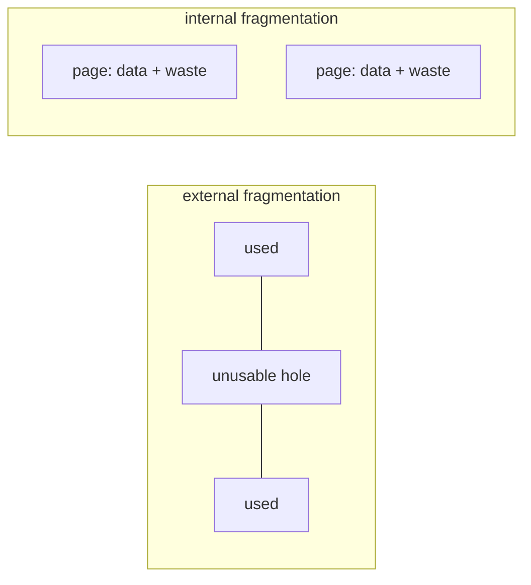
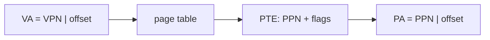
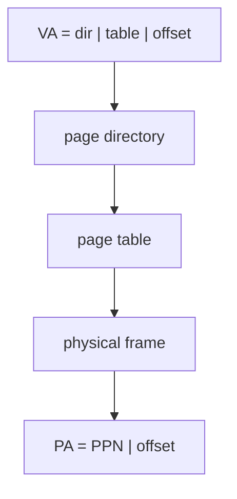
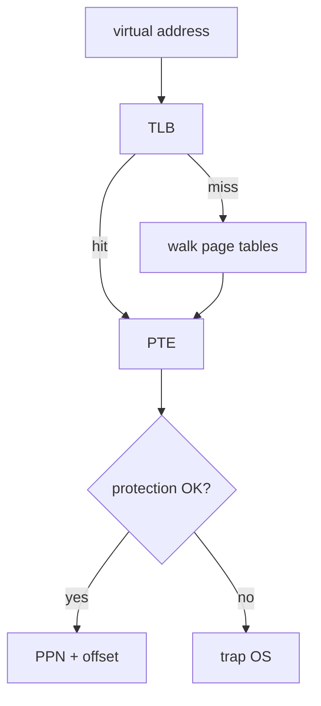
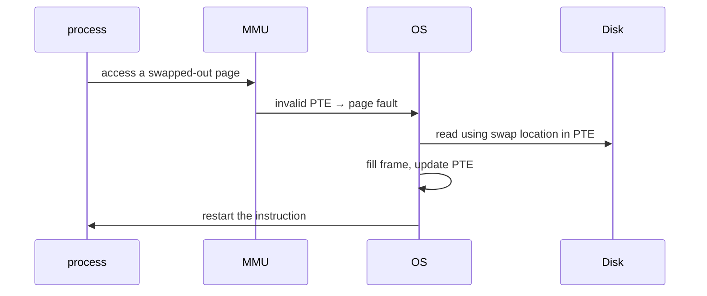
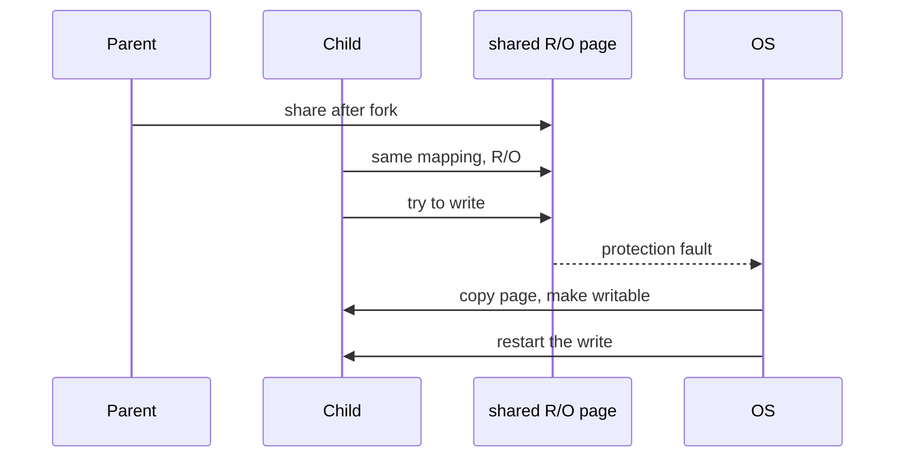

# CSCC69 Week 5–6 期末复习笔记｜Virtual Memory and Paging

> **课件 / Slides：** `CSCC69-VirtualMemory.pdf`, `CSCC69-Paging.pdf`  
> **写法 / Style：** 中英对照，同一份文档。

---

## 问题：程序如何共存于内存 / How Programs Coexist in Memory

编译把符号地址绑成编译单元内的可重定位地址；链接再解析跨文件符号，得到可执行文件里的绝对逻辑地址。函数和数据地址写进二进制，程序不能随便放到任意物理地址。  
The compiler binds symbols to relocatable addresses inside an object file; the linker resolves cross-file symbols into absolute logical addresses in the executable. Those addresses are baked in, so the program cannot sit at a random physical address.

**Load-time linking**（装载时再重定位）不够：运行中如何再搬家？没有足够大的连续空闲区怎么办？如何防止进程互相干扰？  
**Load-time linking** is not enough: how do you relocate while running? What if no contiguous free region fits? How do you stop processes from interfering?

共享物理内存的三个议题 / Three issues in sharing physical memory:

- **Transparency**：进程不该绑定特定物理地址，却常需要大块连续空间（栈、大数组）。  
A process should not need particular physical bits, yet often wants large contiguous memory.
- **Resource exhaustion**：所有进程大小之和常超过物理内存。  
The sum of process sizes often exceeds RAM.
- **Protection**：A 不能读/写 B 的内存。  
A must not even observe B’s memory.

---

## 虚拟内存目标 / Virtual Memory Goals

给每个程序自己的 **virtual address space**；让程序以为内存比物理内存更大；在进程间分配稀缺内存，尽量高性能、低开销；强制保护。  
Give each program its own **virtual address space**; let programs see more memory than exists; allocate scarce RAM with high performance and low overhead; enforce protection.

程序 load/store 用 **virtual address**；真正内存用 **physical address**。**MMU**（通常在 CPU 里）做翻译，通过特权指令配置。每个进程看到的视图叫 **address space**。  
Programs load/store **virtual addresses**; RAM uses **physical addresses**. The **MMU** (usually in the CPU) translates, configured by privileged instructions. Each process’s view is its **address space**.

好处：进程运行中可以在内存里搬家，或被 swap 到磁盘。  
Benefit: a process can move in RAM or be swapped to disk while running.

实现路线：**base+bound → segmentation → paging**。  
Path: **base+bound → segmentation → paging**.

---

## Base & Bound

两个特权寄存器。每次访存：物理地址 = 虚地址 + base；检查 `0 ≤ VA < bound`，否则 trap。上下文切换时必须重装这两个寄存器。  
Two privileged registers. On each access: PA = VA + base; check `0 ≤ VA < bound`, else trap. The OS must reload them on a context switch.

优点：硬件便宜（两个寄存器），加法和比较可并行。缺点：进程变大很贵；无法共享代码/数据。下一步：把 code/stack/data 分成多个段。  
Cheap hardware (two registers) and cheap cycles (add and compare in parallel). Expensive to grow a process; no sharing of code/data. Next: split code/stack/data into segments.

---

## Segmentation

每个进程一组 base/bound（segment table）。可按段共享和保护。虚地址 = **段号（高位）+ offset（低位）**。x86 段寄存器：CS, DS, SS, ES, FS, GS。  
Each process has many base/bound pairs (a segment table). Share/protect at segment granularity. VA = **segment (high bits) + offset (low bits)**. x86 segment registers: CS, DS, SS, ES, FS, GS.

查表：offset < bound？是则 `base + offset`。  
Lookup: if offset < bound, PA = base + offset.

优点：稀疏地址空间、易共享、不必整个进程都在内存。缺点：翻译有代价；**外部碎片** 严重。  
Pros: sparse address spaces, easy sharing, process need not be fully in RAM. Cons: translation cost; **external fragmentation**.

### 碎片 / Fragmentation

**External fragmentation**：可变大小分配，留下小洞。  
Variable-sized pieces leave unusable holes.

**Internal fragmentation**：固定大小块，块内浪费。  
Fixed-size pieces waste space inside a block.

---

## Paging（引言）/ Paging (Introduction)

把内存切成 **固定大小的页**，消灭外部碎片。虚页映射到物理页（frame），保护粒度是页。代价：平均每个“段”大约 0.5 页的内部碎片。  
Divide memory into **fixed-size pages** to kill external fragmentation. Virtual pages map to physical frames; protection is per page. Cost: about 0.5 pages of internal fragmentation per “segment”.

例：4KB 页 → offset 12 bit。VA = VPN（高位）+ offset。**Page table**：VPN 索引到 PTE。PTE 含 PPN 和标志位。  
Example: 4KB pages → 12-bit offset. VA = VPN (high) + offset. The **page table** maps VPN → PTE. A PTE holds a PPN and flags.

| 位 Bit                | 含义 Meaning               |
| -------------------- | ------------------------ |
| Modify / Dirty       | 是否写过 / written           |
| Reference / Accessed | 是否读或写过 / read or written |
| Valid                | 这条 PTE 能否用 / usable      |
| Protection           | R/W/X                    |
| PPN                  | 物理页号 / frame number      |

优点：从空闲页链表分配；无外部碎片；swap 块大小整齐，可用 valid 位发现被换出的页。  
Easy allocation from a free list of fixed chunks; no external fragmentation; swap units match disk blocks; valid bit detects swapped pages.

限制：仍有内部碎片；至少两次访存 → **TLB**；页表太大（32-bit、4KB 页 → 4MB/进程）→ **多级页表**。  
Still internal fragmentation; ≥2 memory refs → **TLB**; page tables are huge (4MB/process on 32-bit 4KB pages) → **multi-level page tables**.

### x86 同时有分段和分页 / x86 Has Both

段基址 + 指针 = linear address，再做页翻译。分段有 CPL 0–3；分页只有 kernel/user 两档，故 CPL 0–2 当内核，3 当用户。  
Segment base + pointer = linear address, then paging. Segmentation has CPL 0–3; paging has only two levels, so CPL 0–2 = kernel, 3 = user.

---

## 更小的页表：两级页表 / Smaller Tables: Two-Level Paging

单级页表必须覆盖整个地址空间。实际只用一部分，所以加一层。VA 三部分：**master page number**（page directory）、**secondary page number**（page table）、**offset**。  
A single-level table maps the whole space. We only need the used portion, so add a level. VA has three parts: **directory index**, **page-table index**, **offset**.

32-bit、4KB 页、4B PTE：offset = 12 bit；directory 要装进一页：4KB/4B = 1024 项 → 10 bit；每个 page table 同样 1024 项 → 10 bit。**10+10+12 = 32**，这就是常用 4KB 页的原因之一。每个 page table 覆盖 4MB 虚存着·。  
32-bit, 4KB pages, 4B PTE: 12-bit offset; directory fits in one page → 10 bits; each page table also 1024 entries → 10 bits. **10+10+12 = 32**, one reason 4KB pages are natural. Each page table covers 4MB.

x86：`%cr0` 打开分页；`%cr3` 指向 4KB page directory（Pintos：`pagedir_activate()`）。Directory 有 1024 PDE；每个 page table 有 1024 PTE。64-bit 常用 4 级页表，更依赖 TLB。  
x86: `%cr0` enables paging; `%cr3` points at the 4KB page directory (Pintos `pagedir_activate()`). 1024 PDEs, 1024 PTEs each. 64-bit often uses 4-level tables and leans harder on the TLB.

---

## 更快翻译：TLB / Faster Translation: TLB

一级页表 1 次查表+1 次取数；两级 2 次查表；四级 4 次。**TLB** 硬件缓存 VPN → PTE（不是直接缓存物理地址）。32–128 项，4-way 到全相联，一次周期完成。命中率常 >99%。  
One-level: 1 table lookup + 1 fetch; two-level: 2 lookups; four-level: 4. A **TLB** caches VPN → PTE (not the raw physical address) in one cycle. 32–128 entries, 4-way to fully associative. Hit rate often >99%.

命中路径（全硬件）：查 TLB 得 PTE → 检查保护位 → PPN+offset 访存。  
Hit path (all hardware): TLB lookup → check protection → PPN+offset.

**TLB miss**：没有这项，或有但保护位不允许这次访问。  
A **TLB miss** is “no PTE in the TLB” or “PTE present but protection forbids this access”.

**TLB miss ≠ page fault**：页可能仍在内存，只是翻译没缓存在 TLB。  
A **TLB miss is not a page fault**: the page may still be in RAM.

---

## Swapping 与 Page Fault / Swapping and Page Faults

OS 用磁盘模拟更大虚存：页在内存和 swap 之间搬。内存满了就要 **evict**。对应用透明。**Demand paging（lazy loading）**：第一次访问才从磁盘装入。  
The OS uses disk to simulate larger virtual than physical memory. Full RAM means **evict**. Transparent to the app. **Demand paging**: load a page only when first accessed.

Page fault 来源 / Page-fault sources:

1. **Protection**：不允许的 r/w/x。OS 常把错交给进程；也可能是 CoW、mmap 的“假保护”。
  Disallowed r/w/x. OS often signals the process; sometimes it is “fake” protection for CoW/mmap.
2. **Invalid + 未分配**：真正的 segfault。 / Invalid and unallocated: a real segfault.
3. **Invalid + 已分配但在磁盘上**：分配物理帧，从 swap 读入，改 PTE，重启指令。
  Invalid but allocated on disk: allocate a frame, read from swap, update the PTE, restart the instruction.

换出时：PTE 标 invalid，并在 PTE 里记下 swap 位置。  
On eviction: mark the PTE invalid and store the swap location in the PTE.

置换策略在下一讲。 / Replacement policy is the next lecture.

---

## 高级功能 / Advanced Functionality

### 共享内存 / Shared Memory

把同一物理页映射进多个进程。Unix System V：`shmget`。  
Map the same physical page into multiple processes. Unix System V: `shmget`.

**不同虚地址映射**：灵活，但共享区内部指针无效。  
Different VAs: flexible, but pointers inside the region are invalid.

**相同虚地址映射**：指针有效，但不灵活。  
Same VA: pointers work, less flexible.

需要同步。 / Needs synchronization.

### Copy-on-Write（CoW）

`fork` 本要复制整个地址空间。CoW：父子先共享物理页并标只读。谁先写 → 保护 fault → OS 拷贝该页、改映射、重启写指令。  
`fork` would copy the whole space. CoW: parent and child share frames read-only. First writer gets a protection fault; OS copies the page, remaps, restarts the write.

### Mapped files（mmap）

用 load/store 做文件 I/O：虚存区域绑到文件。VA_base+N 对应文件 offset N。一开始 PTE invalid，第一次访问从文件读；换出或 unmap 时若 dirty 则写回。  
Do file I/O with loads/stores: bind a VA region to a file. VA_base+N is file offset N. PTEs start invalid; first access reads from the file; dirty pages write back on evict/unmap.

优点：文件和内存同一套指针接口。缺点：进程不能精细控制数据何时搬；不适合管道/socket。  
Pro: uniform pointer interface. Cons: less control over data movement; does not generalize to pipes/sockets.

---

## 考试速记 / Exam Cheat Sheet

- 会画 base+bound、分段、分页、两级页表、TLB 的翻译路径。  
Draw translation for base+bound, segmentation, paging, two-level tables, and TLB.
- 外部碎片（段）vs 内部碎片（页）。  
External fragmentation (segments) vs internal (pages).
- 算出 32-bit 两级页表为什么是 10+10+12。  
Show why 32-bit two-level paging is 10+10+12.
- TLB miss ≠ page fault。  
A TLB miss is not a page fault.
- fork 用 CoW；mmap 用 demand paging + dirty bit。  
fork uses CoW; mmap uses demand paging + the dirty bit.
- Pintos：`%cr3`、pagedir、用户指针必须在用户虚址范围内且 mapped。  
Pintos: `%cr3`, pagedir; user pointers must be in user VA range and mapped.

