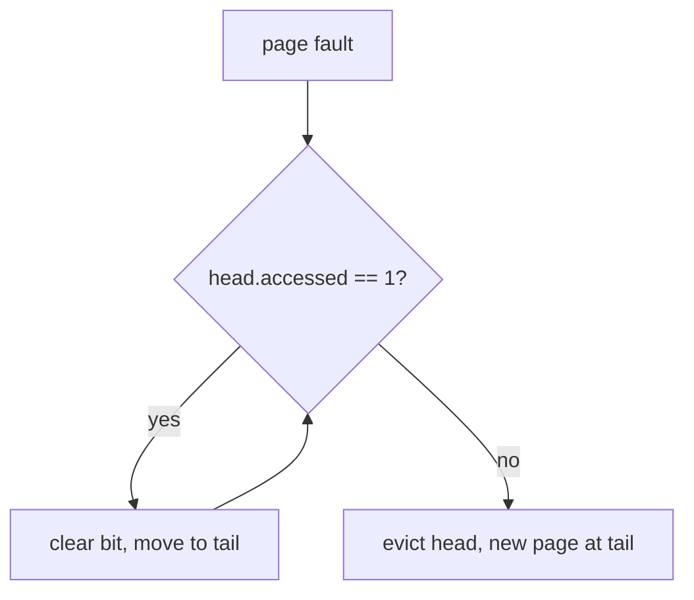
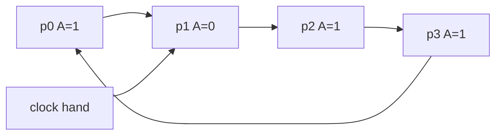

# CSCC69 Week 7 期末复习笔记｜Memory Management (Page Replacement)

> **课件 / Slides：** `CSCC69-MemoryManagement.pdf`  
> **写法 / Style：** 中英对照，同一份文档。

上一讲解决“怎么翻译、怎么缺页装入”。本讲解决：**物理帧不够时赶走谁**。  
The last lecture covered translation and loading a missing page. This one answers: **who to evict when frames run out**.

---

## 发生了什么 / What Happens

Page fault 时 OS 要把缺的页装进物理内存。若没有空闲帧（或进程达到帧上限），必须 **evict** 一页到 swap。  
On a page fault the OS loads the missing page. If no free frame (or the process hit its frame cap), it must **evict** a page to swap.

**Page replacement algorithm** 的目标：选牺牲页，使后续 **fault 率最低**。  
The **replacement algorithm** picks a victim to minimize later **fault rate**.

用 **reference string**（页号访问序列）数 miss 次数来比较算法。课件统一用：  
Compare algorithms on a **reference string** by counting misses. The slides use:

`1, 2, 3, 4, 1, 2, 5, 1, 2, 3, 4, 5`

---

## FIFO

赶走在内存里待最久的页。实现简单。3 帧时课件结果：**9 misses**。  
Evict the oldest page in memory. Simple. With 3 frames the slides get **9 misses**.

### Belady’s Anomaly

**增加物理帧，FIFO 的缺页次数可能反而增加。** 同一串访问：3 帧 9 次 miss，4 帧 **10** 次 miss。  
**More physical frames can mean more FIFO faults.** Same string: 9 misses with 3 frames, **10** with 4.

所以“内存更大一定更好”对 FIFO 不成立。  
So “more RAM is always better” is false for FIFO.

---

## Belady’s Algorithm（OPT）

若知道未来，赶走 **最久以后才会再用** 的页。已证明最优。现实无法预知未来，只当 **理论上界**。课件 4 帧例子：**6 misses**。  
If you knew the future, evict the page used **farthest in the future**. Proven optimal. Impossible in practice; use it as an **upper bound**. Slide example with 4 frames: **6 misses**.

---

## LRU（Least Recently Used）

课件标题写成 Last Recently Used，就是常用的 LRU：赶走 **过去最久没被用过** 的页。用“最近的过去”近似未来。同一例子 4 帧：**8 misses**，好于 FIFO，差于 OPT。  
The slides say “Last Recently Used”; this is standard **LRU**: evict the page unused for the longest time in the past. The recent past approximates the future. Same 4-frame example: **8 misses**, better than FIFO, worse than OPT.

精确 LRU 很难做：每次访问在 PTE 打时间戳、缺页时扫全表 → 访存翻倍；或用双向链表，访问就移到队尾 → 太贵。所以实践中 **近似 LRU**。  
Exact LRU is expensive: timestamp every access and scan, or move a linked-list node on every hit. Practice **approximates LRU**.

---

## Second Chance（时钟 / Clock）

用硬件 **accessed / reference bit**。课件 4 帧例子也是 **8 misses**（与 LRU 相同）。  
Uses the hardware **accessed/reference bit**. The 4-frame slide example also gets **8 misses** (same as LRU).

### Version 1：FIFO-like

页在链表里，有 head/tail。hit：该页 accessed=1。miss：若 head.accessed==1，清零并移到 tail（给第二次机会）；若为 0，则换出 head，新页放到 tail。  
Pages in a list with head/tail. Hit: set accessed=1. Miss: if head.accessed==1, clear it and move to tail (a second chance); if 0, evict head and put the new page at the tail.

性能尚可，但 miss 时可能要转很多页。  
OK performance, but a miss may rotate many pages.

### Version 2：Clock

页排成环，一根 clock hand。hit：accessed=1。miss：hand 指向的页若 accessed==1，清零并前进；若 ==0，换出它，装入新页，hand 再前进一步。  
Pages in a ring with one hand. Hit: accessed=1. Miss: if hand’s accessed==1, clear and advance; if 0, replace that page, install the new one, advance.

不必在 miss 时把整条链旋转，通常优于 FIFO-like second chance。  
No full-list rotation on every miss; usually better than FIFO-like second chance.

hand 扫到 A=1 的页只清位；扫到 A=0 才换出。  
The hand only clears A=1 pages; it evicts when A=0.

---

## 其他算法 / Other Algorithms

**Random**：实现极简，能避开 Belady 异常，效果“不算太糟”。  
**Random:** trivial, avoids Belady’s anomaly, “not overly horrible”.

**LFU**：按访问次数，次数少的赶走；要随时间 decay。刚换入的页次数也少，可能误伤。  
**LFU:** evict least frequently used; decay counts over time. A just-loaded page also has a low count, so it can be evicted too soon.

**MFU**：认为次数最少的可能刚进来还没用，反而留它。LFU/MFU 都很少用。  
**MFU:** keep the low-count page because it may have just arrived. Neither LFU nor MFU is common.

---

