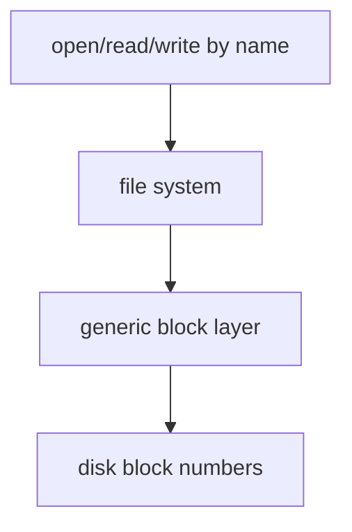
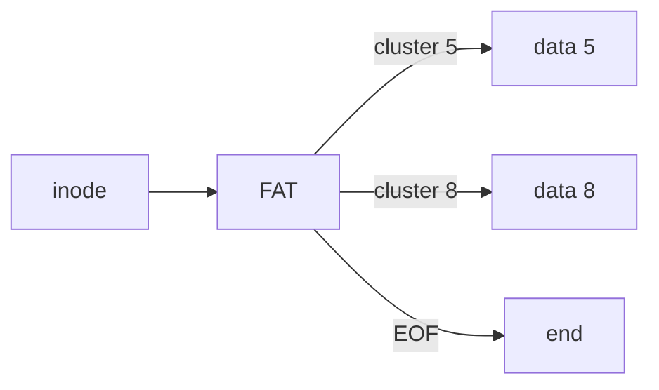
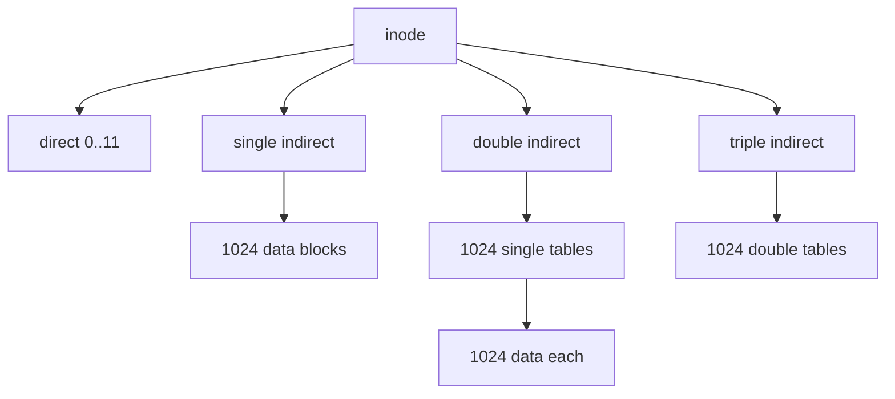
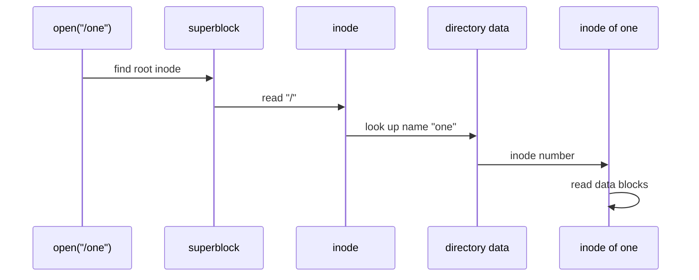
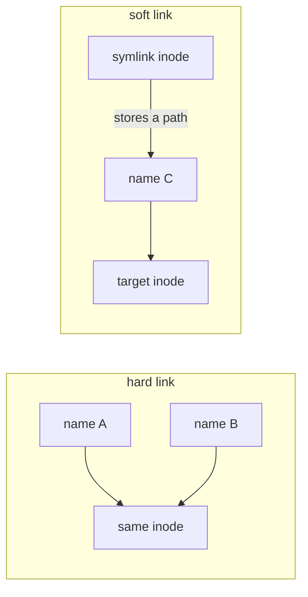
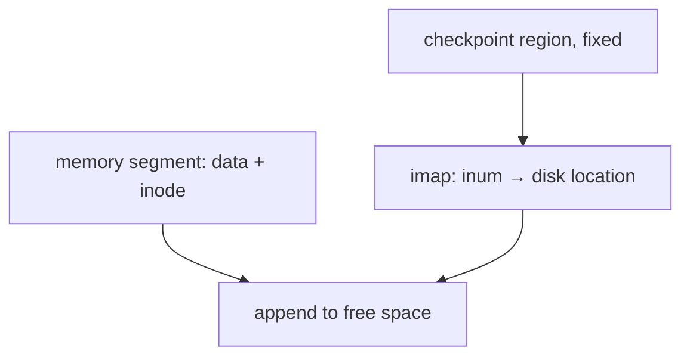

# CSCC69 Week 8–9 期末复习笔记｜File Systems

> **课件 / Slides：** `CSCC69-FileSystems.pdf`  
> **写法 / Style：** 中英对照，同一份文档。

---

## 文件系统在栈中的位置 / Where the FS Sits

FS 不管具体是哪类磁盘，它向 **generic block layer** 发块读写请求。用户看到的是文件名和字节，底下是块号。  
The FS does not care which disk class it uses; it issues block reads/writes to the **generic block layer**. Users see names and bytes; underneath are block numbers.

目标：为二级存储提供 **file** 抽象；用 **directory** 逻辑组织；允许共享；保护数据。  
Goals: an abstraction (**files**) for secondary storage; organize files (**directories**); share data; protect it.

---

## 文件抽象 / The File Abstraction

文件 = 磁盘上有名字的一串字节 + 属性（大小、所有者、时间、权限等）。  
A **file** is named bytes on disk plus properties (size, owner, times, protection, …).

类型可以是 FS 理解的（块设备、字符设备、链接、FIFO、socket），或 OS/运行库理解的（文本、图片、`.so`/`.dll`、可执行文件）。  
A type may be understood by the FS (block/char device, link, FIFO, socket) or by the OS/runtime (text, image, `.so`/`.dll`, executable).

Windows 靠扩展名；Unix 常靠内容（magic number，如 `#!`）。  
Windows encodes type in the name; Unix often in contents (magic numbers, e.g. `#!`).

访问方式 / Access methods:

- **Sequential**（FS 最常见）：按顺序读下一个。 / Most common in file systems: read/write next.
- **Random**（FS 也支持）：按偏移读写。 / Read/write at offset n.
- **Indexed / Record**（数据库更常见）。 / More typical of databases.

Unix：`create/open/read/write/sync/seek/close/unlink`。Windows 对应 `CreateFile/ReadFile/.../DeleteFile`。`open` 返回 **fd / handle**。  
Unix: `create/open/read/write/sync/seek/close/unlink`. Windows: `CreateFile/ReadFile/...`. `open` returns an **fd/handle**.

设计约束：多数文件很小；磁盘空间大多在大文件上；很多 I/O 打在大文件上；既要顺序快也要随机快。跟踪文件数据的结构叫 **inode**，inode 自己也在盘上。  
Most files are small; most disk space is in large files; much I/O hits large files; we want both sequential and random access. The structure tracking a file’s blocks is an **inode**, stored on disk too.

---

## 分配方式 / Allocation

课件对比三类：Straw Man（Pintos 基础 FS）、FAT、FFS。  
The slides compare three: straw man (Pintos base FS), FAT, and FFS.

### Straw Man #1：连续分配 / Contiguous (Extent)

创建时预知长度，一次分配连续块。Inode 只需位置+大小。顺序/随机都快。问题：和分段一样的 **外部碎片**。  
Pre-specify length and allocate all space at once. Inode stores location+size. Fast sequential and random. Problem: **external fragmentation**, like segmentation.

### Straw Man #2：块链表 / Linked Files

空闲块链表；inode 指向第一块，每块存下一块指针。增长容易、无外部碎片。问题：磁盘上跟着指针跳，随机访问要遍历；指针还占块内空间。  
Free-block list; inode points at the first block; each block points to the next. Easy growth, no external fragmentation. Bad: pointer chasing on disk; random access walks the whole file; pointers steal block space.

---

## FAT

把链表指针集中放到固定的 **File Allocation Table**，而不是散在每个数据块里。仍是 pointer chasing，但表可缓存。  
Put the links in a fixed-size **FAT** instead of inside data blocks. Still pointer chasing, but the table can be cached.

FAT16 粗算（课件）/ Slide arithmetic:

- 表项 16 bit → 最多 65536 项。 / 16-bit entries → 65,536 max.
- 块 512B → FS 最大约 32MB。 / 512-byte blocks → ~32MB FS.
- 空间开销 2B/512B ≈ 0.4%。 / Overhead ~0.4%.
- 可靠性：磁盘上放 **FAT 副本**。 / Duplicate FAT copies for reliability.
- 根目录在盘上固定位置。 / Root directory at a fixed disk location.

---

## Unix Fast File System（索引 + bitmap）

### 纯索引表 / Indexed Files

每个文件一张块指针表。顺序/随机都容易。问题：表要连续大空间；最大文件受表大小限制。  
Each file has a table of block pointers. Sequential and random are easy. Problem: the table wants a large contiguous chunk; max size is capped by the table.

### 空闲空间：bitmap / Free Space: Bitmaps

无组织空闲链表会让顺序文件块散开。Bitmap：每位表示一块空闲与否，容易找连续空闲块，通常整个放内存。  
An unorganized freelist scatters sequential file blocks. A **bitmap** marks free/allocated blocks, makes contiguous search easy, and usually fits in RAM.

### 磁盘布局 / On-Disk Layout

物理上按 **sector**（常 512B），FS 逻辑上按 **block**（如 4KB）分配。  
The disk is physically **sectors** (often 512B); the FS allocates **blocks** (e.g. 4KB).

| 符号 | 内容 Content |
| --- | --- |
| S Superblock | magic（FS 类型）、bitmap/inode 占用块数 / magic, sizes |
| i inode bitmap | 哪个 inode 空闲 / which inodes are free |
| d data bitmap | 哪个数据块空闲 / which data blocks are free |
| I inode table | inode 数组 / inode array |
| D data blocks | 文件和目录内容 / file and directory data |

课件小例子：64 个 4KB 块 → 物理 256KB；扣掉元数据后逻辑约 224KB；inode 256B、5 块 inode 区 → 最多 80 个文件。  
Slide mini-disk: 64×4KB = 256KB physical; ~224KB data after metadata; 256B inodes × 5 blocks → 80 inodes max.

### Unix inode（简化字段）/ Simplified Inode Fields

mode、uid/gid、size、atime/ctime/mtime/dtime、links_count、blocks、**15 个块指针**、ACL。  
mode, uid/gid, size, atime/ctime/mtime/dtime, links_count, blocks, **15 block pointers**, ACLs.

若 15 个全是直接指针：15×4KB=60KB，太小。  
If all 15 are direct: 15×4KB = 60KB — too small.

### 多级索引（必考）/ Multi-level Index (Exam Favourite)

前 **12 个直接指针** → 小文件很快；然后 **一级、二级、三级间接**。  
First **12 direct pointers** make the first blocks fast; then **single, double, and triple indirect**.

4KB 块、4B 指针 → 每块 1024 个指针：  
4KB blocks, 4B pointers → 1024 pointers per block:

| 结构 Structure | 大约最大文件 / Approx max size |
| --- | --- |
| 12 直接 / 12 direct | 48 KB |
| + 一级间接 / + single | ~4 MB |
| + 二级间接 / + double | ~4 GB |
| + 三级间接 / + triple | ~4 TB |

设计理由：多数文件很小（常见约 2K）；平均文件在变大；**多数字节在少数大文件里**；目录通常很小。  
Rationale: most files are small (~2K is common); average size is growing; **most bytes live in a few large files**; directories are typically small.

---

## 目录与链接 / Directories and Links

目录两件事：给人看名字；给 FS 把逻辑名字和物理放置分开。Unix 目录就是一种特殊文件。  
Directories give humans structured names, and give the FS a naming interface separate from physical placement. In Unix, a directory is just a special file.

历史：全系统一个目录 → 每用户一个目录 → **层次命名空间**（树，若允许链接则是图）。根目录永远是 **inode #2**（0、1 历史上保留）。  
History: one directory for the system → one per user → **hierarchical names** (a tree, or a graph with links). Root is always **inode #2** (0 and 1 were reserved).

特殊名字：`/` 根，`.` 当前，`..` 父 —— FS 提供。`~`、glob `foo.*` —— **shell** 提供，不是 FS。  
Special names: `/` `.` `..` are from the FS. `~` and glob `foo.*` are from the **shell**, not the FS.

路径查找 `/one`：superblock 找到 `/` 的 inode → 读目录找 `one` → 得到其 inode 号 → 读 inode → 找数据块。  
Path lookup of `/one`: superblock finds `/`’s inode → open `/` and look up `one` → get that inode number → read the inode → read data blocks.

每个进程有 **cwd**。不以 `/` 开头的路径相对 cwd。  
Each process has a **cwd**. Names not starting with `/` are relative to cwd.

### 硬链接 vs 软链接 / Hard vs Soft Links

**Hard link**：多个目录项指向 **同一个 inode**。inode 里 `links_count`。删一个名字只要 count>0 数据还在；count 到 0 才释放。  
A **hard link** is another directory entry for the **same inode**. `links_count` tracks pointers. Removing one name leaves the data if count > 0; space is freed only at 0.

**Soft / symbolic link**：指向一个 **名字**。目标可以不存在或被删。inode 有 symlink 位，内容是目标路径。FS 遇到时自动翻译。  
A **soft link** is a synonym for a **name**. The target may be missing. The inode has a symlink bit and stores the path; the FS translates it when encountered.

---

## 崩溃一致性 / Crash Consistency

扇区写入通常原子，但一次 FS 操作会改 **多个扇区**（bitmap、inode、数据）。中途断电 → **crash-consistency problem**。  
A sector write is atomic, but one FS operation touches **several sectors** (bitmaps, inodes, data). A crash in the middle is the **crash-consistency problem**.

### 方案 1：fsck

启动时扫不一致（inode 指针 vs bitmap、目录项 vs link count），尝试修。不能覆盖所有情况；大盘可能跑几小时。  
On boot, scan for inconsistencies (inode pointers vs bitmaps, directory entries vs link counts) and try to fix. Cannot cover every crash; large volumes may take hours.

### 方案 2：LFS（Log-structured / CoW logging）

把磁盘当磁带：在内存缓冲一段（含 inode），再 **顺序追加** 写到空闲位置，不覆盖旧数据。  
Treat the disk like a tape: buffer a segment (including inodes) in memory, then **append sequentially** to free space; never overwrite in place.

inode 不再在固定位置 → 需要 **imap**（inode 号 → 盘上位置）。imap 的入口在固定的 **checkpoint region (CR)**，大约每 30 秒更新。  
Inodes are no longer at a fixed place, so LFS needs an **imap** (inum → disk location). The imap is found from a fixed **checkpoint region (CR)**, updated about every 30s.

CR 原子更新：写两个 CR，分三步（时间戳1、body、时间戳2）。两个时间戳不一致说明崩溃。选最新且合法的 CR。  
Atomic CR update: two CRs, written in 3 steps (timestamp #1, body, timestamp #2). Mismatched timestamps mean a crash. Pick the newest valid CR.

旧版本留在盘上 → **cleaning / GC**：空闲或空间不够时压缩有效段。  
Old versions remain → **cleaning/GC** when idle or out of space.

### 方案 3：Journaling（WAL）

先把“打算做什么”写到日志，再改真正 FS。崩溃后 replay 已提交事务。  
Write **intent** to a log before updating the real FS (**write-ahead logging**). After a crash, recover by redoing committed transactions.

**Linux ext3 物理日志** / Physical journaling in ext3:

1. 把脏块作为一笔事务写入 journal（TxBegin、inodes、bitmaps、data）。 / Commit dirty blocks as one transaction.
2. 写 TxEnd（commit）。 / Write the commit record.
3. Checkpoint：拷到真正 FS。 / Copy to the real FS.
4. 回收 journal 空间。 / Reclaim journal space.

崩溃情况 / Crash cases:

- 只有 TxBegin 没有 TxEnd → 未提交，忽略。 / No TxEnd → ignore.
- Tx 完整但还没 checkpoint → redo。 / Committed but not checkpointed → redo.
- 已 checkpoint 但 journal 还没回收 → 再 redo 一遍通常是幂等的。 / Checkpointed but not freed → redo is usually idempotent.

### Journaling 模式 / Journaling Modes

一次写可能变成两次磁盘写。  
One write can become two disk writes.

| 模式 Mode | 做什么 What | 特点 Trade-off |
| --- | --- | --- |
| Data journaling | 数据和元数据都进日志 / journal data+metadata | 最安全，最贵 / safest, costliest |
| Metadata journaling | 只日志元数据 / metadata only | 文件里可能是垃圾数据 / file may contain garbage |
| Ordered（ext3 默认） | **先把文件数据写到真正 FS**，再日志元数据 / **write data to real FS first**, then journal metadata | 旧文件里可能出现新数据 / old file may contain new data |

---

## 考试速记 / Exam Cheat Sheet

- 会比较连续、链表、FAT、多级 inode。  
  Compare contiguous, linked, FAT, and multi-level inodes.
- 会算间接块带来的最大文件大小（12 + 1024 + 1024² + 1024³）× 4KB。  
  Compute max file size from 12 + 1024 + 1024² + 1024³ times 4KB.
- 目录是文件；路径查找从 inode 2 开始。  
  Directories are files; path lookup starts at inode 2.
- 硬链接计引用，软链接存路径。  
  Hard links count references; soft links store a path.
- 崩溃：fsck 慢且不完美；LFS 顺序写+CR+imap+GC；journaling 先记再做。  
  Crashes: fsck is slow/incomplete; LFS is sequential write+CR+imap+GC; journaling logs first.
- ext3 ordered vs data vs metadata 各自牺牲什么。  
  Know what each ext3 journaling mode sacrifices.
- Pintos FS 项目：可扩展 inode、目录、缓冲缓存，对应本讲 straw man → FFS。  
  Pintos FS: extensible inodes, directories, buffer cache — straw man toward FFS.
