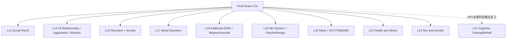

# PSYA02 Final Exam 期末复习总笔记｜Summer 2026

> **来源：** `PSYA02- Final Exam Information_Summer 2026_Posted.pdf` + Lectures 13–23 课堂笔记  
> **写法：** 不是 PPT 直译；按“怎么考 + 怎么答 + 可能出什么简答”重组。  
> **覆盖提醒：** 官方 LO 汇总页写了 L13–20、L22、L23；**未单独列出 L21**。L21 仍建议复习（尤其 training vs rehab、near/far transfer），因属本学期教学内容。  
> **L14 & 15：** 官方把人际/攻击/利他等内容合并为 Lectures 14 & 15；本仓库笔记对应 `lecture14-interpersonal-relationships.md`。

---

## 一、考试基本盘（先算清分）

| 项目 | 内容 |
|---|---|
| **时间** | Friday, August 14 · 9:00–11:30 am |
| **地点** | HL170 |
| **作答时长** | **2 hours (120 min)**（窗口 2.5h，按 120 分钟规划） |
| **座位** | 考前在 **Quercus** 查 seat assignment |
| **结构** | **45 MC × 1** + **6 Short Answer（共 25 分）** = **/70** |
| **权重** | **Final Grade 的 45%** |
| **允许** | Student ID、笔、橡皮、铅笔、透明瓶清水 |
| **禁止** | **No aids**（无笔记/电子/字典等） |

### 时间分配建议（拓展）

```text
120 min total
├── MC 45题 ≈ 55–60 min  (~1.2–1.3 min/题)
├── SA 6题  ≈ 50–55 min  (~8–9 min/题)
└── 复查填涂 ≈ 5–10 min
```

**解读：** SA 占 25/70 ≈ **36%**，但题数少，**漏答一部分 = 直接丢大分**。官方反复强调：读题慢、画关键词、答全所有小问、不交白卷。

---

## 二、考前准备与复习策略（官方要求 + 解读）

### 2.1 带什么 / 怎么准备状态

- Quercus 查座位；带 **Student ID**、笔/铅笔/橡皮、清水  
- 前一晚睡够；官方明确：**Cramming is NOT helpful**  
- 考试当天吃早餐  

### 2.2 Scantron 填涂（易丢“行政分”）

必须手写并涂满气泡：

1. Last name  
2. First name  
3. Student number（例示逻辑：`1002345678` 逐位涂泡）  
4. 注意卷面 **Version**（A/B…）按要求标识  

**边做边涂 Scantron**，不要最后一次性誊写。

### 2.3 官方 Study Tips（转化成行动）

| 官方建议 | 你怎么做 |
|---|---|
| Review **lecture + textbook** | 以 LO 为目录；笔记补“定义/对比/研究” |
| MindTap / Square Cap 练题 | 练到能解释为何对/错 |
| Use Learning Objectives | 本文第三、五部分就是 LO 题库化 |
| FSG / 手写笔记 / flashcards | 主动回忆 > 反复盯 PPT |
| Teach a friend | 能讲清 = 能写清 SA |
| Use AI appropriately | 可当教练；别抄不可核验内容；注意版权 |

---

## 三、选择题怎么做（官方 7 条）

1. **慢慢读题**（slowly）  
2. 下划线关键词/概念  
3. **先自己想答案，再看选项**  
4. 不确定就 ✅ / ❌ 排除法  
5. **holistically** 想概念联系（同一研究可考多种说法）  
6. **勿留空**；卡住约 **2 分钟**就猜并标记回头  
7. **边答边涂** Scantron  

### 官方样题 1｜Milgram（答案：b）

> Stanley Milgram examined obedience to authority. Which best explains the main conclusions?

- a. 只在权威“个人可信”时才服从  
- **b. Situational factors（如合法权威在场）可强烈推动人服从与自身价值观冲突的命令** ✅  
- c. 攻击性人格更易服从有害命令  
- d/e. 只要他人心理/身体受害就会拒绝服从  

**解读：** 核心不是“坏人人格”，而是 **situation / legitimate authority** 的力量。

### 官方样题 2｜Zimbardo / Social Roles（答案：d）

随机分配社会角色后，哪项最符合 SPE 发现？

- a. 被随机分到老师 → 更领导/辅导；学生 → 更用功 ✅（角色内化）  
- b. 主厨 → 更权威；sous chef → 更服从 ✅  
- c. 警察更宽容、劫匪几乎不变 ❌（与“权威角色变强硬”相反）  
- **d. Two of the above are likely** ✅  
- e. All of the above ❌  

**金句：** 随机角色 → 行为朝角色脚本偏移（权力方更支配，从属方更顺从）。

---

## 四、简答题怎么拿满（官方最重要）

### 4.1 指令动词（必须对号入座）

| 动词 | 你要写什么 |
|---|---|
| **Identify** | 点名术语/概念 |
| **Define** | 给准确定义 |
| **Describe** | 细节化说明过程/特征 |
| **Compare** | **相似 + 差异** 都要写 |

### 4.2 官方四步法

1. 慢慢读  
2. 画线关键词（尤其是多个小问）  
3. 判断要你做什么（method? findings? define concept?）  
4. 写全、写显式——**TA 不能脑补你“其实懂”**

### 4.3 官方样题：Zimbardo（完整示范答）

**题干结构拆解：**

```text
Describe Philip Zimbardo’s Study
├── (1) brief overview of methodology
├── (2) summary of findings
└── (3) identify AND describe the concept studied
```

**示范答案（整合官方片段 + 课堂要点）：**

> Zimbardo conducted the **Stanford Prison Experiment**. Undergraduate students were recruited and **randomly assigned** to be **prison guards** or **prisoners** in a simulated prison; the study was designed to last **2 weeks**.  
> **Findings:** Participants became so consumed by their **social roles** that the study ended after only a **few days** (about day 6) because of severe abuse of prisoners by guards.  
> **Concept:** Zimbardo examined **social roles**—the expected patterns of behaviour tied to a position in society (e.g., guard vs prisoner). The experiment shows that situational roles can powerfully reshape behaviour, beyond stable personality alone.

**得分解剖：**

| 小问 | 必须出现的关键词 |
|---|---|
| Method | undergrads；random assignment；guards/prisoners；~2 weeks planned |
| Findings | role consumption；abuse；early termination |
| Concept | **social roles** + 定义 + 例子 |

---

## 五、官方 Learning Objectives 覆盖图（考什么）



---

## 六、高概率简答题题库（L13–23）+ 示例答案

> **说明：** 题型模仿官方样题（多小问：define / describe / compare / identify + method/findings）。  
> 答案用“可直接默写”的长度；考试按分值伸缩。  
> ★ = 与官方样题同构或 LO 明确点名，优先级最高。

---

### Lecture 13｜Social Psychology ★★★

#### Q13-1 ★（官方同构）Describe Zimbardo’s Stanford Prison Experiment
（见第四节示范答案）

#### Q13-2 ★ Describe Milgram’s obedience study: method, findings, and the concept studied

**答：**  
**Method:** Participants told it was a **memory/learning** study; “teacher” gave supposedly increasing shocks (**15V steps**, up to **450V**) to a learner (confederate) under an experimenter’s orders.  
**Findings:** About **65%** went to the maximum **450V**, despite distress—showing high obedience.  
**Concept:** **Obedience to authority**—following orders from a perceived legitimate authority, even when orders conflict with personal morals. Situational authority cues strongly drive behaviour.

#### Q13-3 ★ Define conformity and describe Asch’s experiment (method + findings)

**答：**  
**Conformity** = changing behaviour/beliefs to match a group standard/norm.  
**Method:** Participants judged line lengths among **confederates** who gave wrong answers.  
**Findings:** Roughly **75%** conformed at least once; many yielded to the incorrect majority. Shows normative social pressure can override clear evidence.

#### Q13-4 Define the bystander effect and explain diffusion of responsibility and pluralistic ignorance

**答：**  
**Bystander effect:** likelihood of helping **decreases** as number of witnesses increases.  
**Diffusion of responsibility:** each person feels **less personally responsible** when others are present.  
**Pluralistic ignorance:** people look to others; if others seem calm, they **misread** the situation as non-emergency and fail to act.

```text
Emergency
   │
   ├─ Many bystanders → "someone else will help" (diffusion)
   └─ Others look calm → "must not be serious" (pluralistic ignorance)
        └─ Less helping (bystander effect)
```

#### Q13-5 Define FAE and give an example; contrast with a situational explanation

**答：**  
**Fundamental Attribution Error:** tendency to overemphasize **dispositional** causes and underemphasize **situational** causes when explaining others’ behaviour.  
**Example:** A classmate is late → “they’re lazy” (disposition) rather than “subway delay” (situation).

#### Q13-6 Define self-fulfilling prophecy and give a brief example

**答：**  
An expectation about a person leads to behaviour that **causes** the person to act in ways that **confirm** the expectation.  
**Example:** Teacher expects Student A to excel → more attention/challenge → A performs better → expectation “confirmed.”

#### Q13-7 Define groupthink and describe how it produces poor decisions

**答：**  
**Groupthink:** faulty decision-making when **cohesion/consensus** is overvalued, suppressing dissent and contrary information.  
Groups may reach agreement too quickly, ignore risks/alternatives, and produce flawed plans.

---

### Lectures 14 & 15｜Attraction, Influence, Aggression, Altruism ★★★

#### Q14-1 ★ Identify and briefly describe three types of romantic attraction

**答：**  
1. **Physical attraction:** based on appearance; often noticed first (e.g., Walster: physical attraction uniquely predicted felt attraction).  
2. **Situational attraction:** proximity/being around someone + arousal contexts (e.g., Capilano Bridge: arousal misattributed as attraction).  
3. **Psychological attraction:** similarity/personality/shared preferences increase liking (e.g., Moreland & Zajonc: more shared preferences → higher attraction).

#### Q14-2 Compare hedonic motive and approval motive in social influence

**答：**  
**Hedonic motive:** seek pleasure / avoid pain; rewards and punishments can control behaviour (but rewards can backfire).  
**Approval motive:** seek acceptance / avoid rejection; leads people to follow **norms** and **conform** to gain approval.

#### Q14-3 ★ Define aggression; illustrate the Frustration–Aggression Hypothesis; name one biological and one cultural factor

**答：**  
**Aggression:** behaviour intended to harm another.  
**Frustration–Aggression:** blocked goals/desires increase aggression (e.g., cut in line → irritation → hostile outburst).  
**Biological:** genetics (~large heritability contribution cited in lecture).  
**Cultural:** norms that glorify toughness/violence can raise aggression; aggression is **not inevitable**.

#### Q14-4 Compare kinship selection and reciprocal altruism

**答：**  
**Kinship selection:** help genetic relatives to promote shared genes.  
**Reciprocal altruism:** help others expecting future return favours.  
Both can look “helping,” but kinship is gene-sharing logic; reciprocity is exchange-over-time logic.

#### Q14-5 Define cooperation and relate it to solving resource scarcity (vs aggression)

**答：**  
**Cooperation:** working together toward shared/mutual goals.  
Instead of competing aggressively over scarce resources, cooperation is another strategy for managing scarcity and improving joint outcomes.

---

### Lecture 16｜Psychological Disorders & Anxiety ★★★

#### Q16-1 Define psychological disorder / abnormal psychology; describe DSM-5 diagnosis “common criteria”

**答：**  
**Psychological disorders** are clinically significant patterns of cognition/emotion/behaviour that involve distress and/or impairment.  
**Abnormal psychology** studies these patterns scientifically.  
**DSM-5** provides shared diagnostic criteria. Most disorders require: (1) symptoms meeting criteria, (2) **distress/impairment**, (3) not better explained by another diagnosis.

#### Q16-2 ★ Compare GAD, phobic disorders, and panic disorder

| | GAD | Phobia | Panic Disorder |
|---|---|---|---|
| Core | chronic **diffuse** worry | fear of **specific** target | recurrent **unexpected** attacks |
| Time cue | often ≥6 months | cue-triggered | fear of next attack |
| Insight | worry hard to control | often know fear excessive | fear physiological catastrophe |

#### Q16-3 Contrast specific phobia vs social phobia; apply preparedness theory

**答：**  
**Specific phobia:** maladaptive fear of a particular object/situation (animals, heights, etc.).  
**Social phobia:** fear of public **humiliation/embarrassment**.  
**Preparedness theory:** humans more readily acquire fears of ancestrally dangerous cues (snakes/heights), so those phobias are more common than many modern dangers.

---

### Lecture 17｜Mood Disorders ★★★

#### Q17-1 ★ Compare MDD, Dysthymia, and Double Depression

**答：**  
**MDD:** one or more **major depressive episodes** (intense symptoms, episodic).  
**Dysthymia:** chronic, longer-lasting, typically less intense depressed mood.  
**Double Depression:** dysthymia **plus** superimposed major depressive episodes.

```text
Mood severity
High |     /\  /\     ← MDD episodes
     |    /  \/  \
Mod  |---==========--- ← dysthymia baseline (Double Depression)
Low  |________________
```

#### Q17-2 ★ Characterize Helplessness Theory with an example

**答：**  
Depression risk rises when people explain failures as **internal, stable, and global** (“It’s me; it’ll always be this way; it ruins everything”).  
Healthier style: **external/mutable/local** (“situation; can change; this domain only”).  
**Example (breakup):** helpless—“I’m unlovable forever, ruins all relationships.” vs healthier—“mismatch now; I can learn; other areas OK.”

#### Q17-3 Differentiate bipolar disorder from MDD; mention one bio and one psych factor for bipolar

**答：**  
**MDD (unipolar):** depression without mania/hypomania history.  
**Bipolar:** involves **manic/hypomanic** episodes (elevated/irritable mood, increased energy/activity) in addition to (often) depression.  
**Biological:** strong genetic/biological contribution.  
**Psychological:** stress, sleep disruption, and cognitive/behavioural patterns can trigger/maintain episodes (course framing).

---

### Lecture 18｜Additional DSM + Biopsychosocial ★★★

#### Q18-1 Identify core features of OCD and contrast with Hoarding Disorder

**答：**  
**OCD:** **obsessions** (intrusive thoughts) → **compulsions** (rituals) that temporarily reduce anxiety; now under OC-related (not simply an anxiety disorder).  
**Hoarding:** persistent difficulty discarding possessions → clutter/accumulation impairing function; core is discarding difficulty, not necessarily classic washing rituals.

#### Q18-2 Describe PTSD’s defining idea and symptom clusters (high-level)

**答：**  
PTSD follows **trauma exposure** and typically includes: **intrusion/re-experiencing**, **avoidance**, **negative alterations in cognition/mood**, and **arousal/reactivity** changes; often begins within months after trauma. Not “any stress”—needs trauma + clinical pattern.

#### Q18-3 Explain the Biopsychosocial Model with one disorder example

**答：**  
Disorders arise from interacting **biological** (genes, brain, hormones), **psychological** (cognition, learning, coping), and **social** (trauma, support, culture) factors.  
**Example (PTSD):** bio stress-system sensitization + psych fear learning/intrusions + social trauma exposure/support gaps.

#### Q18-4 Identify key features of Gambling Disorder / Alzheimer’s / BPD（任选其一深写）

**短答要点：**  
- **Gambling:** behavioural addiction; dopamine/reward-driven continued gambling despite harm.  
- **Alzheimer’s:** neurocognitive disorder with progressive cognitive decline; brain activity/structure changes (e.g., PET contrast).  
- **BPD (Cluster B):** instability in relationships, self-image, affect; impulsivity; fear of abandonment.

---

### Lecture 19｜Treatment System + Psychotherapy ★★★

#### Q19-1 Why treatment matters; identify barriers to seeking/accessing care

**答：**  
Treatment can reduce symptoms, improve functioning, and prevent worsening.  
**Barriers:** stigma, cost, access/wait times, not knowing where to go, believing one “should handle it alone,” minimizing severity.

#### Q19-2 ★ Compare psychodynamic, person-centered, and CBT approaches

| Approach | Focus | Method flavor |
|---|---|---|
| **Psychodynamic/psychoanalysis** | unconscious conflicts/insight | explore past roots |
| **Person-centered (humanistic)** | growth, congruence | empathy, unconditional positive regard, genuineness |
| **CBT** | present thoughts + behaviours | restructuring + behavioural change; transparent, skills-based |

#### Q19-3 ★ Use the ABC Model to explain cognitive restructuring（画图更好）

```text
A Activating event  →  B Beliefs  →  C Consequences (emotion/behaviour)

Same A (fail a midterm)
├─ Irrational B ("I'm worthless") → unhealthy C (hopelessness, give up)
└─ More rational B ("bad grade; I can change study strategy") → healthier C (concern + plan)
```

**答：** CBT targets **B** (beliefs), not only A; restructuring changes consequences.

---

### Lecture 20｜Biological Treatments ★★★

#### Q20-1 Summarize antipsychotics, anxiolytics, and antidepressants (target + rough mechanism)

**答：**  
- **Antipsychotics:** treat psychotic symptoms (e.g., schizophrenia); often reduce **dopamine** signaling; typical agents have notable motor side effects.  
- **Anti-anxiety (anxiolytics):** reduce anxiety (often via calming CNS); risk of tolerance/dependence with some classes.  
- **Antidepressants:** elevate monoamine signaling (e.g., **SSRIs** increase synaptic serotonin by blocking reuptake; **MAOIs** reduce breakdown).

#### Q20-2 ★ Compare ECT, TMS, and DBS

| | ECT | TMS | DBS |
|---|---|---|---|
| What | electrical stimulation under anesthesia → controlled seizure | magnetic pulses to cortex | surgically implanted electrodes |
| Invasiveness | medical procedure + anesthesia | non-invasive | highly invasive |
| Typical use | severe/treatment-resistant illness | treatment-resistant depression etc. | last-resort resistant cases |

---

### Lecture 21｜Cognitive Training & Rehabilitation（PPT LO 未单列，仍建议）

#### Q21-1 ★ Compare cognitive training vs cognitive rehabilitation

| | Training | Rehabilitation |
|---|---|---|
| Style | often standardized adaptive tasks | individualized, goal-oriented |
| Target | improve specific cognitive skills | meaningful daily functioning/participation |
| Transfer issue | **near** transfer common; **far** transfer harder | focuses on real-life goals/compensation |

#### Q21-2 Define near vs far transfer; give one example

**答：**  
**Near transfer:** gains on similar tasks/skills.  
**Far transfer:** gains on dissimilar real-life outcomes.  
**Example:** working-memory training improves WM tests (near) but may not reduce relapse (far).

#### Q21-3 What is errorless learning and why use it in dementia care?

**答：**  
Teach in ways that **minimize errors** during learning so incorrect responses are not practiced/strengthened; useful when memory/error monitoring is impaired.

---

### Lecture 22｜Health & Stress ★★★

#### Q22-1 Define stress vs stressors; differentiate acute / chronic / traumatic stressors

**答：**  
**Stress** = physical/psychological **response**; **stressors** = perceived threats/challenges/deviations.  
**Acute:** short (minutes–hours); **Chronic:** weeks–years; **Traumatic:** immediate threat to physical integrity (most severe).

#### Q22-2 ★ Explain primary vs secondary appraisal; relate to challenge vs threat

```text
Event
 └─ Primary appraisal: threat?
      ├─ No → little stress
      └─ Yes → Secondary appraisal: resources/control enough?
           ├─ Resources > demands → Challenge
           └─ Demands > resources → Threat → stronger stress
```

#### Q22-3 Describe Glass & Singer (1972) and the take-home message

**答：**  
People did puzzles under unpredictable noise; those with **perceived control** (could turn noise off, even if unused) made **fewer errors** than no-control group.  
**Take-home:** **perceived control shapes the stress response.**

#### Q22-4 ★ Explain the Diathesis–Stress Model; OR stages of GAS

**Diathesis–Stress:** disorder emerges from **predisposition (diathesis)** × **stress**; high diathesis needs less stress to cross threshold.  

**GAS:** **Alarm** (mobilize) → **Resistance** (cope; other processes downregulated) → **Exhaustion** (reserves depleted → illness/injury risk).

#### Q22-5 Identify strategies to build resilience

**答：** physical activity; healthy sleep; healthy diet; social support; relaxation techniques (stress-buffering + direct health benefits).

---

### Lecture 23｜Gender & Sexuality 1 ★★★

#### Q23-1 ★ Define sex vs gender; define gender roles vs gender identity

**答：**  
**Sex:** biologically determined (genes, hormones, genitals); examples male/female/**intersex**.  
**Gender:** psychologically/societally determined; related to but not determined by biology; spectral.  
**Gender roles:** cultural expectations for how men/women should look/act.  
**Gender identity:** subjective sense of being a woman/man/(etc.).

#### Q23-2 Describe typical gender differences in aggression, empathy, and sex drive (with one evidence each)

**答：**  
- **Aggression:** men typically higher; ~**7×** violent crime; lab shocks higher (Zeichner).  
- **Empathy:** women typically higher; more considerate social behaviours and emotionally supportive sharing.  
- **Sex drive/casual sex willingness:** men typically higher (Clark & Hatfield; e.g., stranger sex offer ~75% men vs 0% women).  
Remember: **typical/average**, not absolute.

#### Q23-3 ★ Describe three origins of these differences

**答：**  
1. **Evolutionary:** selection favoured male aggression (hunt/fight/defend), female empathy (childcare), and female choosiness due to higher **parental investment**.  
2. **Sociocultural / social learning:** children learn gender roles via modeling + reward/punishment; pressure to fit **gender schemas**.  
3. **Sex double standard:** men praised / women shamed for casual sex; gaps larger in unequal cultures (fear of consequences), similarities rise with **gender equality**.

---

## 七、跨讲“最爱考对比”速查

| 对比 | 一句话 |
|---|---|
| Disposition vs Situation | 归因/服从/角色实验反复打“情境力量” |
| Conformity vs Obedience | 从众跟群体；服从跟权威命令 |
| Diffusion vs Pluralistic ignorance | 责任稀释 vs 误判“没事” |
| GAD vs Phobia vs Panic | 广泛担忧 / 特定恐惧 / 突发惊恐 |
| MDD vs Dysthymia vs Double | 发作性重症 / 慢性轻–中 / 慢性+叠加发作 |
| MDD vs Bipolar | 有无 mania/hypomania |
| Obsession–compulsion vs worry | OCD 循环 vs GAD 弥漫担忧 |
| Psychodynamic vs CBT | 挖无意识过去 vs 改当前思维行为 |
| ECT vs TMS vs DBS | 麻醉发作 / 非侵入磁 / 手术电极 |
| Training vs Rehab | 练认知任务 vs 冲日常功能 |
| Near vs Far transfer | 相似任务增益 vs 真实生活增益 |
| Stress vs Stressor | 反应 vs 触发 |
| Primary vs Secondary appraisal | 威胁？ vs 我能应付？ |
| Challenge vs Threat | 资源够 vs 资源不够 |
| Sex vs Gender | 生物 vs 心理/社会 |
| Evolutionary vs Double standard | 亲代投资 vs 社会奖惩不对等 |

---

## 八、考场简答万能模板（默写骨架）

**若考研究类（仿官方 Zimbardo）：**

```text
1) Name the study + researcher
2) Method: who / assignment / procedure / planned duration
3) Findings: what happened + key stats if known
4) Concept: identify + define + link back to results
```

**若考障碍类：**

```text
1) Core feature (1 sentence)
2) Key criteria / duration / clusters
3) One contrast with a look-alike disorder
4) Optional: prevalence / risk / model
```

**若考治疗类：**

```text
1) Target problem
2) Mechanism / key technique
3) Contrast with alternative approach
```

**若考压力/性别理论类：**

```text
1) Define terms
2) Mechanism steps (use mini flowchart)
3) Evidence or cultural moderator
```

---

## 九、考前一夜清单

- [ ] Quercus 座位号  
- [ ] ID + 笔/铅笔/橡皮 + 透明水瓶  
- [ ] 过一遍本文 **第六部分题号**（能口述答案）  
- [ ] 特别滚一遍：Milgram / Zimbardo / Asch / Helplessness / ABC / ECT-TMS-DBS / Appraisal / Sex≠Gender  
- [ ] 早睡；不临时抱佛脚硬塞新细节  

---

*整合自 Final Exam Information PPT + `note/lecture13`–`lecture23`。考试以课堂与教材为准；本文是复习脚手架，不是官方标答。*
